# Playwright + cucumber + typescript

<details>
<summary>Generic description of Playwright, cucumber and typescript</summary>
<br>

The purpose of this documentation is to explain how we can use an existing automation base structure, in any web automation project.
Its important to know that there are multiple ways of structuring a playwright + cucumber automation, and this is just one of them.


What is playwright: (put link to documentation)


What is cucumber:(put link to documentation)


What is typescript: (put link to documentation)

**Project Structure:**
<details>
  <summary>Click to open project structure images</summary>
  
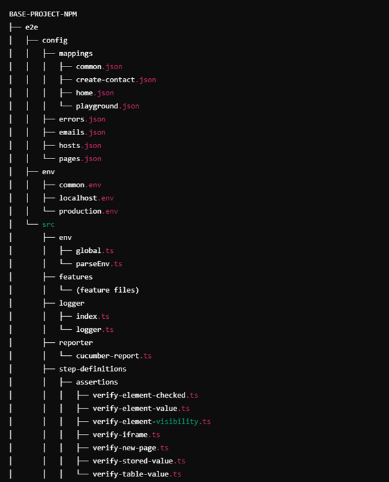
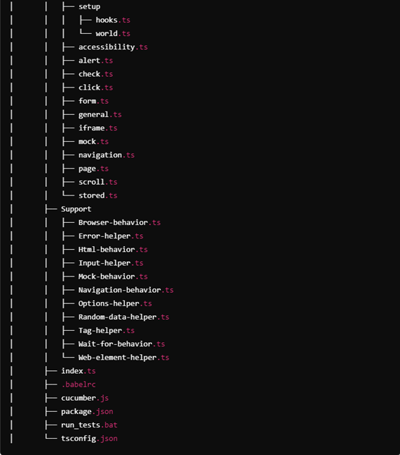
  
</details>

For the purposes of this documentation tutorial, we will be using a test website:

(https://hub.testingtalks.com.au/ )

<details>
  <summary>Click to open testing website image</summary>

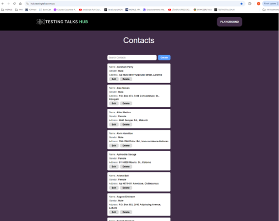

</details>

</details>
<br>


<details>
<summary>Typescript constructs</summary>
<br>

Each construct in TypeScript serves a distinct purpose, but they complement each other to create robust, type-safe, and maintainable applications. The choice of which to use depends on the problem you're solving. Together, these constructs form the backbone of TypeScript development.

1. Functions

**Definition**

- A function is a block of code that performs a specific task and can be reused throughout the program.

- Functions can take inputs (parameters) and return outputs (return values).

**Syntax:**

```ts
function functionName(param1: Type, param2: Type): ReturnType {
  // Function body
  return value;
}
```

**Example:**

```ts
function add(a: number, b: number): number {
  return a + b;
}
console.log(add(2, 3)); // Output: 5
```

**Purpose:**

- Encapsulate logic for reusability.
- Improve code organization and readability.

2. Types

**Definition:**

- A type in TypeScript describes the structure of data, including the shape, attributes, and their types.
- Types ensure type safety by enforcing the expected structure of data.

**Syntax:**

```ts
type TypeName = {
  property: Type;
  method: (param: Type) => ReturnType;
};
```

**Example:**

```ts
type Person = {
  name: string;
  age: number;
};

const john: Person = { name: "John", age: 30 };
```

**Purpose:**

- Enforce a consistent structure for objects, arrays, or other data types.
- Avoid runtime errors by catching type mismatches at compile time.

3. Interfaces

**Definition:**

- An interface is similar to a type but is specifically used to define the structure of objects.
- Interfaces can be extended or implemented by classes.

**Syntax:**

```ts
interface InterfaceName {
  property: Type;
  method(param: Type): ReturnType;
}
```

**Example:**

```ts
interface Animal {
  name: string;
  makeSound(): void;
}

const dog: Animal = {
  name: "Dog",
  makeSound: () => console.log("Woof!"),
};
```

**Purpose:**

- Define contracts for object shapes or class implementations.
- Promote consistent object design in larger projects.

4. Classes

**Definition:**

- A class is a blueprint for creating objects.
- It encapsulates data (properties) and methods that operate on that data.

**Syntax:**

```ts
class ClassName {
  property: Type;
  
  constructor(param: Type) {
    this.property = param;
  }

  method(): ReturnType {
    // Method body
  }
}
```

**Example:**

```ts
class Car {
  make: string;

  constructor(make: string) {
    this.make = make;
  }

  drive(): void {
    console.log(`${this.make} is driving.`);
  }
}

const myCar = new Car("Toyota");
myCar.drive(); // Output: Toyota is driving.
```

**Purpose:**

- Model real-world entities with properties and behaviors.
- Encourage object-oriented programming (OOP) principles like encapsulation, inheritance, and polymorphism.

5. Enums

**Definition:**

- An enum defines a set of named constants that represent a fixed range of values.

```ts
enum EnumName {
  VALUE1,
  VALUE2,
  VALUE3,
}
```

**Example:**

```ts
enum Direction {
  Up,
  Down,
  Left,
  Right,
}

console.log(Direction.Up); // Output: 0
```

**Purpose:**

- Group related constants for readability and maintainability.
- Ensure variables can only take one of a predefined set of values.

6. Modules

**Definition:**

- A module is a file containing code that can be exported and imported into other files.

```ts
// Export
export const value = 42;
export function greet() { console.log("Hello!"); }

// Import
import { value, greet } from './moduleName';
```

**Purpose:**

- Organize code into reusable and maintainable chunks.
- Avoid name collisions and promote modular development.

7. Decorators

**Definition:**

- A decorator is a special kind of function used to modify or annotate classes, methods, properties, or parameters.
- Decorators are a feature of TypeScript when using metadata reflection (used in frameworks like Angular).

```ts
function DecoratorName(target: any, propertyKey?: string, descriptor?: PropertyDescriptor) {
  // Decoration logic
}
```

**Example:**

```ts
function Log(target: any, propertyName: string) {
  console.log(`Property ${propertyName} was accessed.`);
}

class Example {
  @Log
  property: string = "Hello";
}
```

**Purpose:**

- Extend or enhance the behavior of existing components.
- Provide metadata or functionality to classes or methods.

8. Generics

**Definition:**

- Generics allow functions, classes, or interfaces to work with any type, providing flexibility while maintaining type safety.

```ts
function functionName<T>(param: T): T {
  return param;
}
```
**Example:**

```ts
function identity<T>(arg: T): T {
  return arg;
}

console.log(identity<number>(42));  // Output: 42
console.log(identity<string>("Hello"));  // Output: Hello
```

**Purpose:**

- Reuse code for multiple types without sacrificing type safety.

#### How They Link Together

**Types & Interfaces:**

- Define the structure of data used in functions, classes, or objects.

**Classes:**

- Implement interfaces to guarantee a certain structure.
- Use types for method parameters or properties.

**Enums:**

- Provide fixed options for properties or parameters in functions, types, or classes.

**Functions:**

- Use types or interfaces for parameters and return types to ensure type safety.

**Modules:**

- Organize and share functions, classes, types, and other constructs across files.

**Decorators:**

- Enhance the behavior of classes and methods, often linked to metadata.

**Generics:**

- Provide flexibility and type safety in functions, classes, and interfaces, especially for reusable components.

**Conclusion:**

- Each construct in TypeScript serves a distinct purpose, but they complement each other to create robust, type-safe, and maintainable applications. 
- The choice of which to use depends on the problem you're solving. Together, these constructs form the backbone of TypeScript development.

</details>
<br>


<a name="index"></a>

## Index


1. [Installation](#installation)

    1.1 [VisualStudioCodeSettings](#visual-studio-code-settings)

2. [e2e-Folder-Level](#folders-and-files-explanation)

    2.1 [Config-Folder](#e2e--config-folder)
    - [Mapings-folder](#e2e--config--mappings-folder)
      - [Common.json](#common-json)
      - [Create-Contact.json](#create-contact-json)
      - [Home.json](#home-json)
      - [Playground.json](#playground-json)

    - [Emails.json](#e2e--config--emails-json-file)
    - [Errors.json](#e2e--config--errors-json-file)
    - [Hosts.json](#e2e--config--hosts-json-file)
    - [Mocks.json](#e2e--config--mocks-json-file)
    - [Pages.json](#e2e--config--pages-json-file)

    2.2 [Env-Folder](#e2e--src--env-folder)
      - [ParsEnv.ts](#parsenv-ts-file)
      - [Global.ts](#global-ts-file)

    2.3 [SRC-Folder](#e2e--src-folder)
      - [Step-Definitions-Folder](#e2e--src--step-definitions-folder)

        - [Setup-Folder](#e2e--src--step-definitions--setup-folder)
          - [World.ts](#world-ts-file)
          
      - [Support-Folder](#e2e--src--support-folder)
        - [Browser-behavior.ts](#browser-behavior-ts-file)
        - [Error-helper.ts](#error-helper-ts-file)
        - [Html-behavior.ts](#html-behavior-ts-file)
        - [Input-helper.ts](#input-helper-ts-file)
        - [Mock-behavior.ts](#mock-behavior-ts-file)
        - [Wait-for-behavior.ts](#wait-for-behavior-ts-file)
        - [Navigation-behavior.ts](#navigation-behavior-ts-file)


          


## Installation

Save the project:

Save the project folder “BASE-PROJECT-NPM” in the local disk of your computer and rename it if necessary.


Install Node JS recomended version - (https://nodejs.org/en/download/)

Install Visual Studio Code - (https://code.visualstudio.com)

Open Visual Studio Code:

<details>
<summary>Click to open Visual Studio image</summary>


</details>
<br>

Go to Extensions and install the Cucumber (Gherkin) Full Support:

<details>
<summary>Click to open Cucumber extension image</summary>

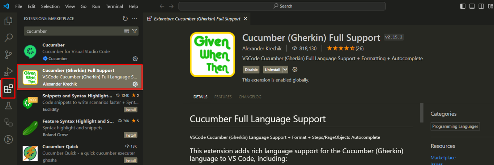

</details>
<br>
 
The following dependencies are already created in the Package.json file:

```ts
{
  "name": "e2e",
  "version": "1.0.0",
  "description": "",
  "main": "index.js",
  "scripts": {
    "precucumber": "rimraf reports && mkdir reports && echo {} > reports/report.json",
    "transpile": "rimraf dist && babel --extensions .ts --out-dir dist src",
    "cucumber": "npm run transpile && cucumber-js",
    "cucumber:localhost": "npm run transpile && cucumber-js",
    "cucumber:production": "npm run transpile && cucumber-js",
    "postcucumber": "cross-env COMMON_CONFIG_FILE=env/common.env ts-node ./src/reporter/cucumber-report.ts"
  },
  "author": "",
  "license": "ISC",
  "devDependencies": {
    "@babel/cli": "^7.25.6",
    "@babel/core": "^7.25.2",
    "@babel/preset-env": "^7.25.4",
    "@babel/preset-react": "^7.24.7",
    "@babel/preset-typescript": "^7.24.7",
    "@cucumber/cucumber": "^10.9.0",
    "@playwright/test": "^1.46.1",
    "@types/body-parser": "^1.19.5",
    "@types/cucumber-html-reporter": "^5.0.1",
    "@types/faker": "^5.5.3",
    "@types/node": "^22.5.1",
    "axe-html-reporter": "^2.2.11",
    "axe-playwright": "^2.0.3",
    "cross-env": "^7.0.3",
    "dotenv": "^16.4.5",
    "faker": "^5.5.3",
    "playwright": "^1.46.1",
    "rimraf": "^6.0.1",
    "ts-node": "^10.9.2",
    "typescript": "^5.5.4"
  },
  "dependencies": {
    "cucumber-html-reporter": "^7.1.1"
  }
}
```
 
These are all the dependencies that we need in the framework structure, to create and execute the test cases and the reports.

Open the Terminal in VS Code:

<details>
<summary>Click to open Terminal access image</summary>

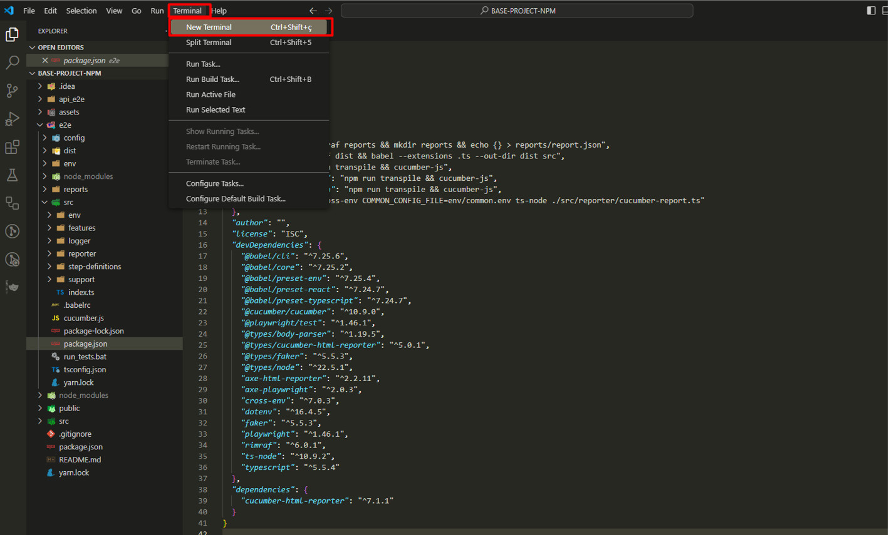

</details>
<br>
 
 The terminal is opened:

<details>
<summary>Click to open Terminal image</summary>

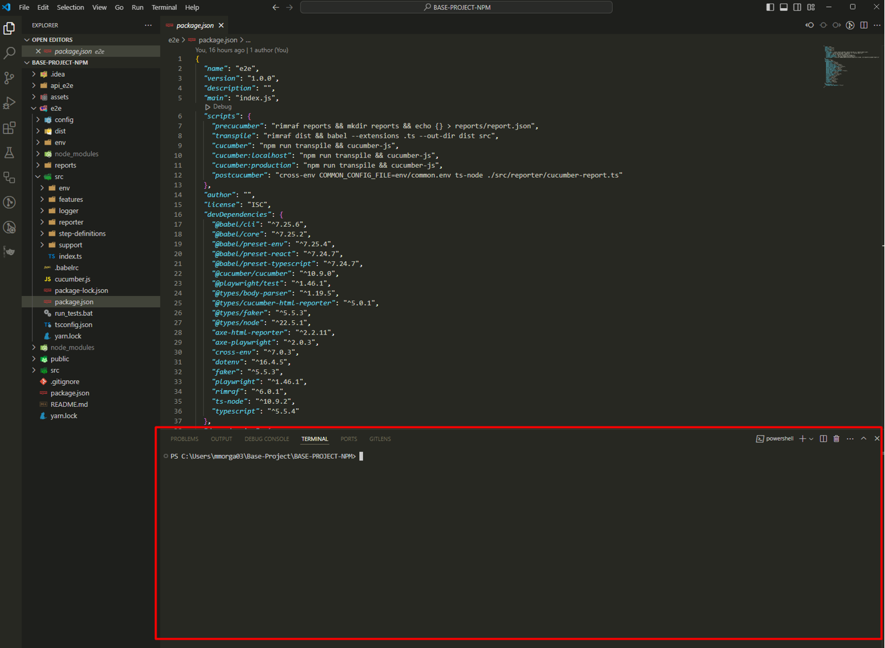

</details>
<br>
 
Navigate to the e2e folder, which is where our end to end project structure is created.

To do this, type “cd e2e” and enter.

The route is now pointing to the e2e folder:

<details>
<summary>Click to open Route image</summary>

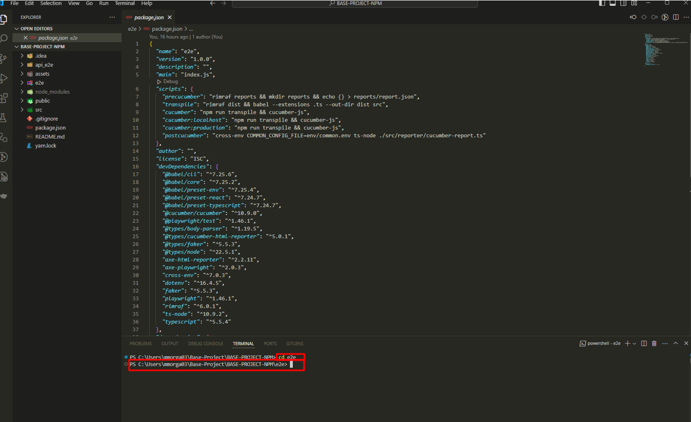

</details>
<br>
 
The dependencies are already in the package.json file, however, they are not installed yet. 

Install the dependencies by writing the following command in the terminal:

To do this, run the command: **npm install** and click **enter**

All the dependencies are now installed.

The project structure inside the e2e folder, looks like this:

<details>
<summary>Click to open Project Structure image</summary>

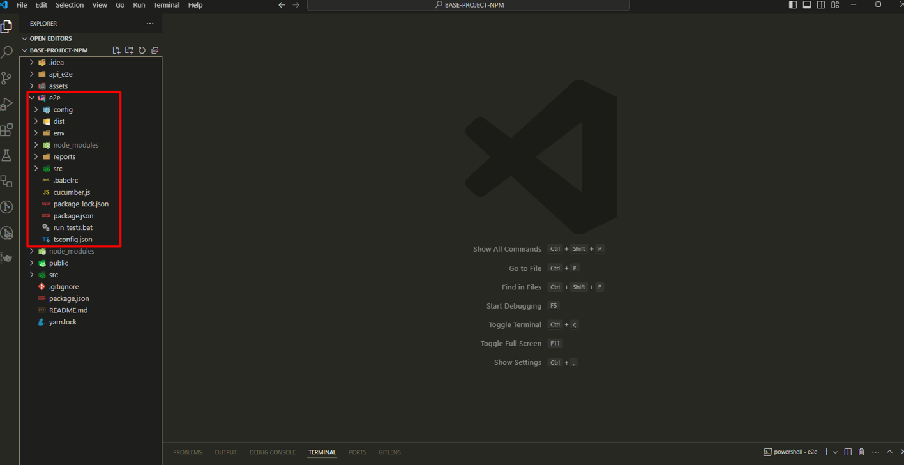

</details>
<br>

## Visual Studio Code settings

Configure the Visual Studio settings.json file, so the cucumber features and the cucumber glue are pointing correctly to our Test Cases features folder and Step definitions.

**Note: Without this configuration, it will not be possible to execute the test cases.**

•	Click CTRL + , to open the settings:
 
<details>
<summary>Click to open Cucumber Settings image</summary>

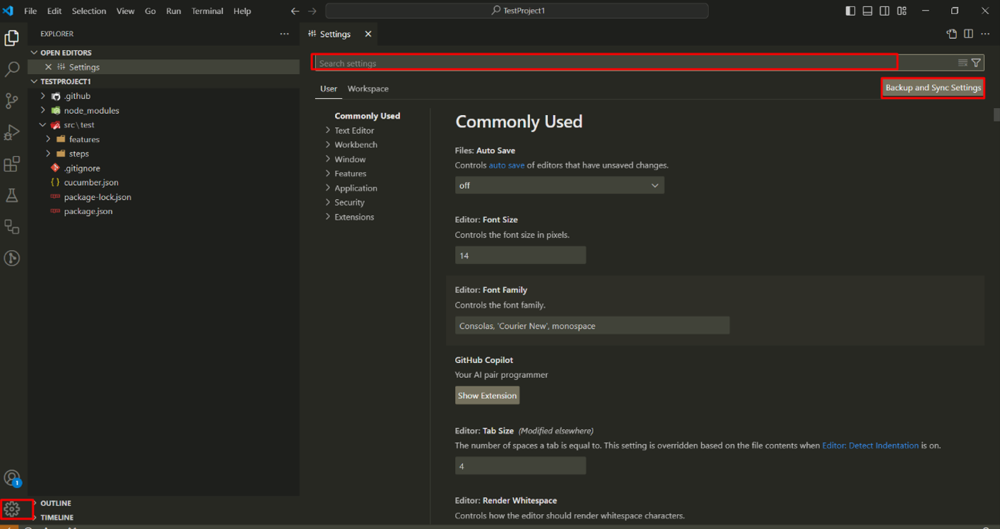

</details>
<br>
  
•	Search for cucumber:
 
<details>
<summary>Click to open Cucumber Search image</summary>

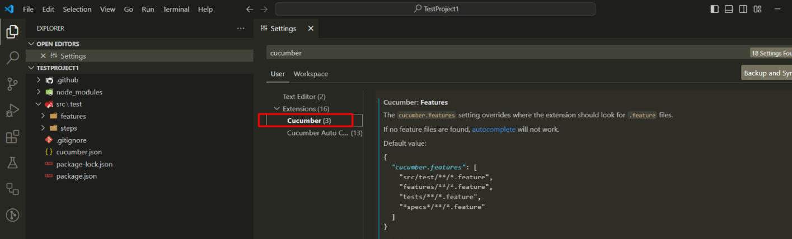

</details>
<br>
 
•	Click in "Editing settings" and define where the feature file is, in Cucumber.Features:

<details>
<summary>Click to open Edit Settings image</summary>

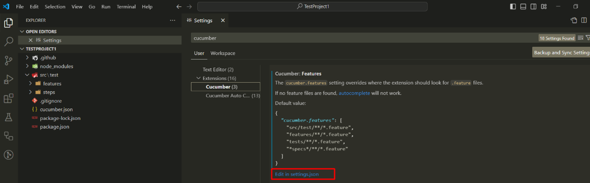

</details>
<br>
  
•	Define where the steps file is in cucumber features and in cucumber.features:


``` ts
"e2e/src/features/*.feature"],
```
<details>
<summary>Click to open Cucumber Feature image</summary>

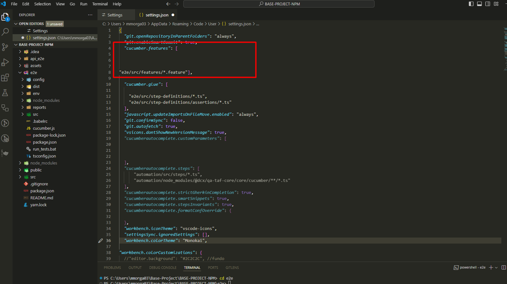

</details>
<br>
 
•	Define where the steps definitions file is, in cucumber.glue:

``` ts
"e2e/src/step-definitions/*.ts",
"e2e/src/step-definitions/assertions/*.ts"
```
<details>
<summary>Click to open Cucumber Glue image</summary>

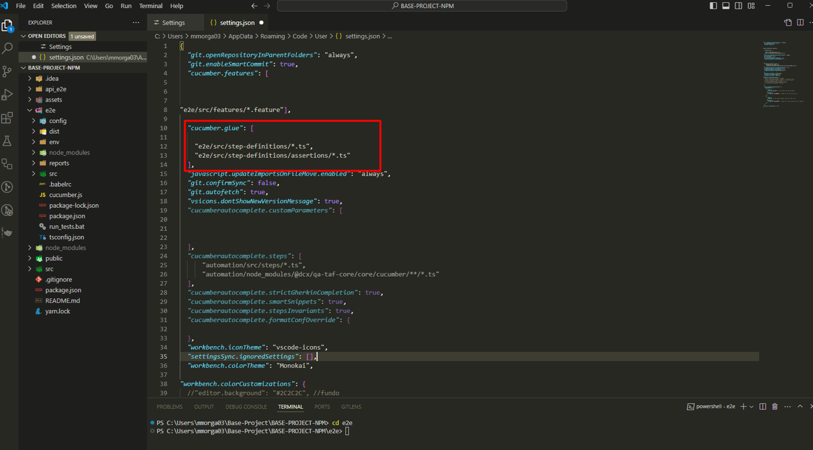

</details>
<br>

### The installation and visual studio configurations are completed.


#### Note: This base template project is already packed with example features tests for each different actions, pointing to the dummy website.

- To guarantee that the npm install correctly installed all the dependencies, select one of the example tests in the features tests folder:

for example, choose the "delete-contact.feature" test

Path:

src > features > delete-contact.feature.

- Instert a @dev tag on the test scenario to be executed:

<details>
<summary>Click to open The test image</summary>

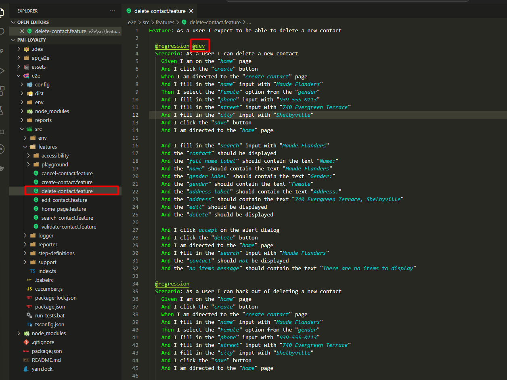

</details>
<br>


- On the terminal, Execute the test with the command ".\run_tests.bat production dev"

<details>
<summary>Click to open the execution command</summary>

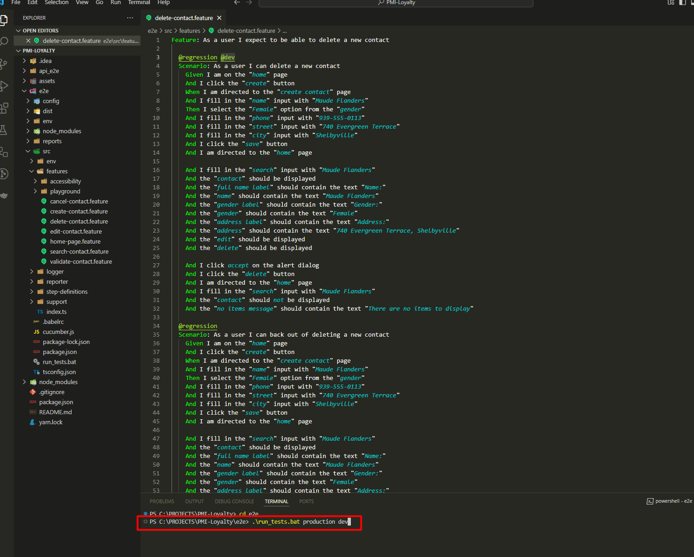

</details>
<br>

- After the execution, the tests will pass and a test report will be created automatically:

<details>
<summary>Click to open the execution result</summary>

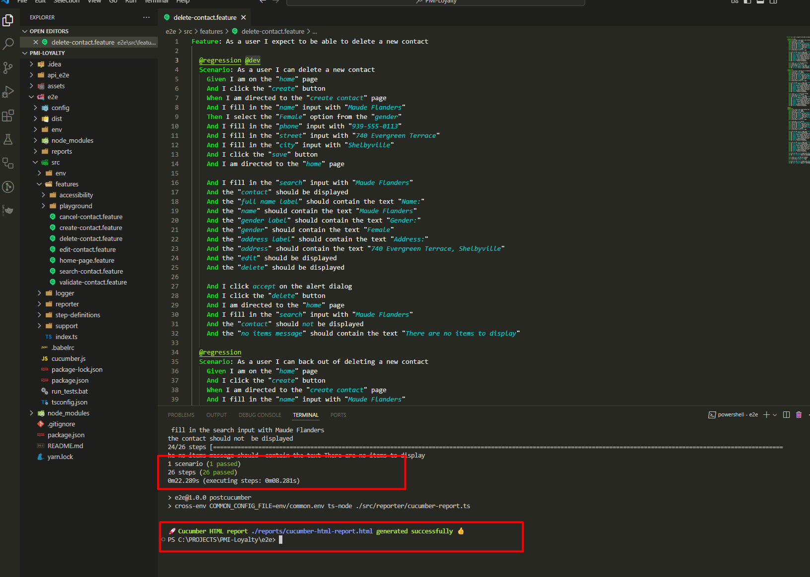

</details>
<br>

[Back to Index](#index)


## FOLDERS AND FILES EXPLANATION:

## e2e \> Config folder:

The config folder holds various configuration files that are used to define and manage the behavior, settings, and environment parameters for our test automation project, and it contains:

#### e2e \> Config \> Mappings folder:

* Inside the Config folder, we have the Mappings folder, which contains configuration files that map different components, data, or behavior of our automation framework.

**Files of the Mappings folder:**

#### Common json:

File content:

```ts
{
  "header logo" : "[data-id='header-logo']",
  "search" : "[data-id='search']",
  "contact" : "[data-id='contact']",
  "full name label" : "[data-id='full-name-label']",
  "gender label" : "[data-id='gender-label']",
  "address label": "[data-id='address-label']",
  "address" : "[data-id='address']",
  "edit" : "[data-id='edit-button']",
  "delete" : "[data-id='delete-button']",
  "name" : "[data-id='name']",
  "gender" : "[data-id='gender']",
  "phone" : "[data-id='phone']",
  "street" : "[data-id='street']",
  "city" : "[data-id='city']",
  "save" : "[data-id='save-button']",
  "cancel" : "[data-id='cancel-button']",
  "playground" : "[data-id='playground-button']",
  "no items message" : "[data-id='no-items-message']",
  "error message" : "[data-id='error-message']"
}
```

This file contains mappings of various UI elements to their corresponding selectors. It provides a centralized way to reference elements across different tests and different pages on the website, thus the name “common”. 

Each key is a descriptive label, and each value is a CSS selector (or other selector type) that identifies the corresponding element on the web page.

**Purpose:**
To simplify and standardize the way UI elements are accessed in tests.
Facilitates easier maintenance, as changes to selectors only need to be updated in one place.


#### Create Contact json:

File content:

```ts
{
  "create contact header" : "[data-id='create-contact-header']"
}
```

This file focus specifically on elements related to creating a new contact.

**Purpose:**
To provide selectors for elements involved in the contact creation process, such as the header of the create contact form.


These selectors are going to be found in the create contact page:

<details>
<summary>Click to open Create-contact-web images</summary>

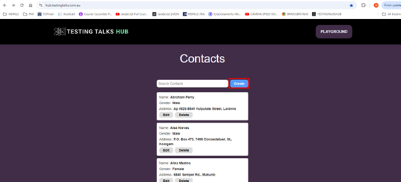
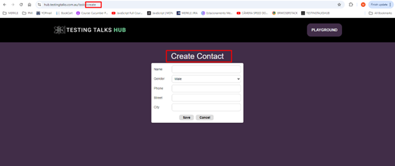

</details>
<br>

#### Home json:

File content:

```ts
{
  "contacts header" : "[data-id='contacts']",
  "create" : "[data-id='add-button']",
  "search" : "[data-id='search']",
  "full name label" : "[data-id='full-name-label']",
  "gender label" : "[data-id='gender-label']",
  "address label" : "[data-id='address-label']",
  "address" : "[data-id='address']",
  "edit" : "[data-id='edit-button']",
  "delete" : "[data-id='delete-button']"
}
```

This file includes selectors relevant to the home page, for managing or displaying contacts inside the home page.

**Purpose:**
To define selectors for elements on the home page, such as headers, buttons for creating contacts, and fields for contact details. This helps in testing functionalities specific to the home view.


These selectors are going to be found in the Home page:

<details>
<summary>Click to open Home-web image</summary>

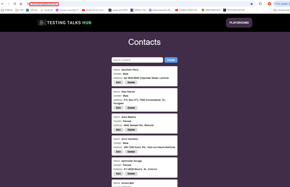

</details>
<br>

#### Playground json:

File content:

```Ts
{
  "female" : "[value='female']",
  "male" : "[value='male']",
  "female label" : "[data-id='female-radio-button']",
  "male label" : "[data-id='male-radio-button']",
  "movies" : "[id='movies-input']",
  "the godfather" : "//li[text()='The Godfather']",
  "the dark knight" : "//li[text()='The Dark Knight']",
  "outlined required" : "[id='outlined-required']",
  "outlined disabled" : "[id='outlined-disabled']",
  "outlined read only" : "[id='outlined-read-only-input']",
  "outlined error" : "[id='outlined-error-helper-text-label']",
  "outlined error text" : "[id='outlined-error-helper-text-helper-text']",
  "blue" : "[data-id='blue-radio-button']",
  "purple" : "[data-id='purple-radio-button']",
  "green" : "[data-id='green-radio-button']",
  "grey" : "[data-id='grey-radio-button']",
  "red" : "[data-id='red-radio-button']",
  "basic iframe" : "[id='basic-iframe']",
  "new tab" : "[data-id='new-tab-button']",
  "open window" : "[data-id='open-window-button']",
  "primary" : "[data-id='primary-button']",
  "secondary" : "[data-id='secondary-button']",
  "third" : "[data-id='third-button']",
  "my button" : "[data-id='my-button']",
  "basic" : "[data-id='basic-table']",
  "switch one" : "[data-id='switch-one']",
  "switch two" : "[data-id='switch-two']",
  "browser alert" : "[data-id='browser-alert']",
  "error alert" : "[data-id='error-alert']",
  "warning alert" : "[data-id='warning-alert']",
  "info alert" : "[data-id='info-alert']",
  "success alert" : "[data-id='success-alert']",
  "tooltip" : "[data-id='tooltip']",
  "textarea" : "[data-id='textarea']",
  "show hide button" : "[data-id='show-hide-button']",
  "show hide text" : "[data-id='show-hide-text']",
  "first value" : "[data-id='first-value']",
  "second value" : "[data-id='second-value']",
  "third value" : "[data-id='third-value']",
  "fourth value" : "[data-id='fourth-value']",
  "fifth value" : "[data-id='fifth-value']",
  "card header" : "[data-id='card-header']",
  "card main" : "[data-id='card-main']",
  "card type" : "[data-id='card-type']",
  "card overview" : "[data-id='card-overview']",
  "card action" : "[data-id='card-action']",
  "avatar" : "[data-id='avatar']",
  "small avatar" : "[data-id='small-avatar']",
  "drop down button" : "[data-id='drop-down-button']",
  "drop down profile" : "[data-id='drop-down-profile']",
  "drop down my account" : "[data-id='drop-down-my-account']",
  "drop down logout" : "[data-id='drop-down-logout']",
  "age" : "[name='age']",
  "email" : "[data-id='email']",
  "password" : "[data-id='password']",
  "email error" : "[data-id='email-error']",
  "full name" : "[data-id='full-name']"
}
```

This file contains a broader set of selectors, for a variety of UI components that may be used across multiple tests, such as radio buttons, input fields, alerts, and more, inside the page “playground”.

**Purpose:**
To provide a comprehensive set of selectors for various interactive elements within a playground environment.
It supports a range of test scenarios inside the playground page.

These selectors are going to be found in the playground page:

<details>
<summary>Click to open Playground-web images</summary>

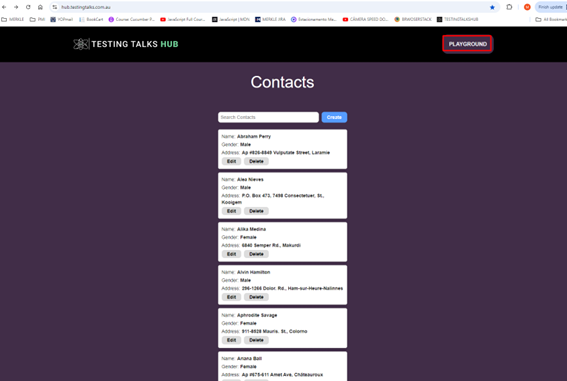

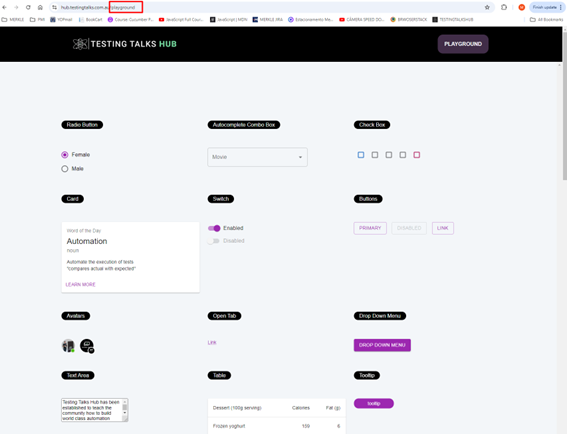

</details>
<br>

**Observations:**

**Centralized Management:** By using these JSON files for mappings, the project allows for centralized management of selectors, which simplifies testing and reduces the risk of errors caused by changes in the UI.

**Readability:** The descriptive keys make it easy to understand what each selector corresponds to, improving the readability of test scripts.

#### e2e \> Config \> Emails json file:

File content:

```Ts
{
    "TEST_EMAIL" : "admin@testingtalkshub.com.au"
  }
```

This file contains email-related configurations, specifically for testing purposes (to be used ahead in our tests).

**Purpose:** It provides a designated email address to be used in tests, ensuring consistency and reliability in scenarios that require email interactions.


#### e2e \> Config \> Errors json file:

File content:

```ts
[
    {
      "originalErrMsgRegexString": "Wait time of [0-9]+ms for [a-zA-Z0-9 ]+exceeded",
      "parsedErrMsg": "🧨 Timed out waiting for the '{}' <> 🧨"
    },
    {
      "originalErrMsgRegexString" : "Cannot read properties of undefined (.*)",
      "parsedErrMsg" : "🧨 Unable to find the '{}' <> mapping 🧨"
    }
  ]
```

This file defines error messages to be used in the automation tests.

**Purpose:** It maps original error message patterns (using regex) to more user-friendly messages. This aids in debugging by making errors clearer and easier to understand during test failures.


#### e2e \> Config \> Hosts json file:

File content:

```ts
{
    "localhost": "http://localhost:3000/",
    "production": "https://hub.testingtalks.com.au/",
    "api" : "https://jsonplaceholder.typicode.com/"
  }
```

This file defines different host URLs for various environments.

**Purpose:** It centralizes the URLs for different environments, enabling easy switching between local development and production environments, as well as providing an API endpoint for tests. (For now, ignore the api)

#### e2e \> Config \> Mocks json file:

File content:

```Ts
{
    "users": "users"
  }
```

This file is used for mocking data in tests.

**Purpose:** It specifies entities to be mocked during tests. In this case, its referring to a "users" object, which will be used to simulate user-related data in various scenarios.

#### e2e \> Config \> Pages json file:

File content:

```ts
{
  "home": {
    "route": "/",
    "regex": "^/$"
  },
  "create contact": {
    "route": "/tasks/create",
    "regex": "^/tasks/create"
  },
  "playground" : {
    "route" : "/playground",
    "regex" : "^/playground"
  },
  "edit contact": {
    "route" : "/edit",
    "regex" : "^/tasks/\\d+/edit"
  }
}
```

This file defines application routes and corresponding regex patterns for different pages.

**Purpose:** It helps in identifying the structure and navigation of the application. Each entry contains a route to navigate to and a regex to match the URL pattern, which will be useful for assertions in tests.

Ex:

Home page:

<details>
<summary>Click to open home-page-example image</summary>

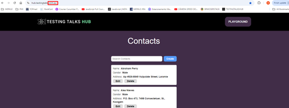

</details>
<br>

Playground page:

<details>
<summary>Click to open playground-page-example image</summary>

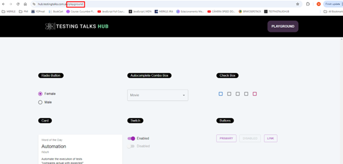

</details>
<br>

[Back to Index](#index)


### e2e \> src \> env folder:

The env folder contains the files:

- global.ts;
- parseEnv.ts.

The env folder serves as a hub for managing environmental configurations and shared types, ensuring that the automation framework or project has access to the right settings and utilities, regardless of the environment it's operating in.

#### parsEnv ts file:

File content:

This file is focused on retrieving environment variables and reading JSON data from files. It has two main functionalities: 

- Accessing environment variables;
- Handling file-based JSON data. 

```ts
export const getJsonFromFile = <T = Record<string, string>>(path: string): T => {
    return require(`${process.cwd()}${path}`);
};

export const env = (key: string): string => {
    const value = process.env[key]
    if (!value) {
        throw Error(`No environment variable found for ${key}`)
    }
    return value;
}

export const envNumber = (key: string): number => {
    return Number(env(key));
};
```

<details>
<summary>Click to open parseEnv.ts code description</summary>
<br>

1:
```ts
export const getJsonFromFile = <T = Record<string, string>>(path: string): T => {
```
***export const:*** This is declaring a constant function and exporting it, which means this function can be used in other files when they import it.

***getJsonFromFile:*** The name of the function. It retrieves and returns the contents of a JSON file.

***<T = Record<string, string>>:*** This is a generic type in TypeScript. It allows the function to return data of any specified type. If no specific type is provided when calling the function, it defaults to returning an object where the keys are strings and the values are strings (Record<string, string>).

***(path: string): T:*** This means the function takes one argument, path, which is a string representing the file path of the JSON file. The function returns data of type T (a generic type).

2: 
```ts
return require(`${process.cwd()}${path}`);
```

***require():*** This is a way to load external files (like JSON files). It is part of Node.js, which is commonly used in Playwright/TypeScript projects. Here, it's used to read the contents of the file at the given path.

***${process.cwd()}:*** This gets the current working directory (the folder where the project is running). cwd stands for "current working directory."

- Template literals (${}): The ${} syntax inside backticks (``) allows you to inject variables or expressions into a string.

- process.cwd() + ${path}: Combines the current working directory with the path provided to get the full path to the JSON file.

***Purpose:*** This line loads the JSON file located at the specified path and returns its contents.

3:
```ts
export const env = (key: string): string => {
```
***export const:*** This is declaring a constant function and exporting it, which means this function can be used in other files when they import it.

***env:*** This is the name of the function. It retrieves the value of an environment variable.

***(key: string):*** string: This means the function takes one argument, key, which is a string (the name of the environment variable). The function returns a string (the value of the environment variable).

4:
```ts
const value = process.env[key]
```

***process.env:*** This is a built-in object in Node.js that contains all the environment variables (key-value pairs) for the current running environment.

- Environment variables are used to store configuration values, like API keys, database URLs, or other settings, outside of our code.

***process.env[key]:*** This retrieves the value of the environment variable with the name key.

5:
```ts
if (!value) {
```

This checks if the value is undefined, null, or an empty string. If the value does not exist, the code inside the block will execute.

6: 
```ts
throw Error('No environment variable found for ${key}')
```

***throw Error():*** This creates a new error and stops the execution. If no value is found for the specified environment variable, this line throws an error with a custom message saying that the variable is missing.

***Purpose:*** To ensure that the environment variable exists, and if not, notify the user by throwing an error.

7:
```ts
return value;
```

If the environment variable exists, it returns the value. This allows other parts of the program to use the retrieved value.

8:
```ts
export const envNumber = (key: string): number => {
```

This defines another function called envNumber, which is similar to env but is specifically designed to return a number instead of a string.

***(key: string): number:*** It takes one argument, key (the name of the environment variable), and returns a number.

9:
```ts
return Number(env(key));
```

***env(key):*** This calls the env function defined earlier to get the value of the environment variable.

***Number():*** This converts the value returned by env(key) (which is a string) into a number. If the value cannot be converted to a valid number, it will return NaN (Not-a-Number).

***Purpose:*** This function is used when you expect an environment variable to be a numeric value (like width, height, port numbers, etc.).

***Summary:***

***getJsonFromFile:*** This function loads and returns the contents of a JSON file from the file system, making it easier to use external configurations.

***env:*** Retrieves a string value from environment variables, throwing an error if the variable is not found.

***envNumber:*** Retrieves a value from environment variables and converts it to a number, ensuring that numerical configurations (like screen size or timeout limits) are properly handled.

These functions are typically used in automation frameworks to handle configurations dynamically, allowing you to change settings (like screen sizes, API keys, etc.) without modifying the actual code.


</details>
<br>

#### Global ts file:

This file defines a set of types and interfaces that are used across the entire project to ensure consistency, especially when dealing with configurations, error handling, and page elements in our automation framework.
It's like a blueprint that specifies what data is available, how it’s structured, and what kind of operations are allowed on it.

The primary purpose of this file is to:

- Define global types for managing different parts of our automation framework.
- Ensure type safety when dealing with configurations, mappings, and errors.
- Create reusable structures to avoid duplication across the project.
- Standardize the handling of mock data, page elements, and configurations.

File content:

```ts
export type PageId = string
export type ElementKey = string
export type ElementLocator = string
export type WaitForTargetType = string
export type MockConfigKey = string
export type MockServerKey = string
export type MockPayloadKey = string
export type WaitForTarget = PageId | ElementKey
export type PageElementMappings = Record<PageId, Record<ElementKey, ElementLocator>>
export type MockPayloadMappings = Record<string, string>
export type PagesConfig = Record<PageId, Record<string, string>>
export type HostsConfig = Record<string, string>
export type ErrorsConfig = ErrorConfig[]
export type MocksConfig = Record<string, string>
export type GlobalVariables = { [key: string]: string }
export type EmailsConfig = Record<string, string>

export type ErrorConfig = {
    originalErrMsgRegexString: string
    parsedErrMsg: string
}

export type GlobalConfig = {
    pageElementMappings: PageElementMappings
    mockPayloadMappings: MockPayloadMappings
    hostsConfig: HostsConfig
    pagesConfig: PagesConfig
    errorsConfig: ErrorsConfig
    emailsConfig: EmailsConfig
    mocksConfig: MocksConfig
};
```

<details>
<summary>Click to open global.ts code description</summary>
<br>

1. Basic Type Aliases

*A type alias in TypeScript is a way to give a name to a type. This helps make the code easier to read and maintain. Think of it like creating shortcuts for certain types of data that will be used frequently.*

```ts
export type PageId = string
export type ElementKey = string
export type ElementLocator = string
export type WaitForTargetType = string
export type MockConfigKey = string
export type MockServerKey = string
export type MockPayloadKey = string
export type WaitForTarget = PageId | ElementKey
```

- PageId, ElementKey, ElementLocator: These define specific types for page IDs, element keys, and locators within our automation framework.

- WaitForTarget: This type allows us to wait for either a PageId or ElementKey—useful for targeting specific elements or pages.

- MockConfigKey, MockServerKey, MockPayloadKey: These are related to mock data handling, assigning string types for keys used in mock configurations and servers.

What does this mean?

PageId:

PageId is just another name for string.
It represents the ID of a page in our application. For example, the homepage might have an ID like "HomePage".
By creating this alias, we make it clear that when we use PageId, we're referring specifically to a page’s identifier.

ElementKey:

Also a string, but this refers to the name or key for an element on a webpage, such as a button, a text box, or a link.
For instance, the key for a login button might be "loginButton".

ElementLocator:

This is a string that represents the location of an element on a page.
It's typically a CSS selector or XPath used by automation tools like Playwright to interact with that element. 

Example: "#loginButton" could be the locator for a button with the ID loginButton.

WaitForTarget:

This type says that a WaitForTarget can be either a PageId or an ElementKey.
This means in our code, when we want to wait for something (like a page or an element to load), we can use either a page ID or an element key.

2. Mappings and Configuration Types

```ts
export type PageElementMappings = Record<PageId, Record<ElementKey, ElementLocator>>
export type MockPayloadMappings = Record<string, string>
export type PagesConfig = Record<PageId, Record<string, string>>
export type HostsConfig = Record<string, string>
export type ErrorsConfig = ErrorConfig[]
export type MocksConfig = Record<string, string>
export type GlobalVariables = { [key: string]: string }
export type EmailsConfig = Record<string, string>

```

- PageElementMappings: Defines a structure for mapping page elements. It's a dictionary where each PageId contains a dictionary of ElementKey-to-ElementLocator mappings. 
This is used to store and retrieve the locators for elements on different pages.

**What does this mean?**

Record<PageId, Record<ElementKey, ElementLocator>>: This is a mapping or dictionary. Think of it like a table that connects pages, elements, and their locators.

Here’s how it works:

The outer Record<PageId, Record<ElementKey, ElementLocator>> is saying: “I have a list of pages, and for each page, I have a list of elements and their locators.”
Inside each page (identified by PageId), there’s another dictionary (Record<ElementKey, ElementLocator>) that maps each element (identified by ElementKey) to a locator (ElementLocator).

- MockPayloadMappings: A dictionary for storing mock payloads, used when mocking server responses.

This defines a mapping between some kind of identifier and a piece of mock data. It’s used when we want to simulate server responses in tests without hitting the actual server.

- PagesConfig: Stores configuration for each page, where the key is PageId and the value is a set of key-value pairs (often used for custom page settings).

- HostsConfig: Maps different hostnames or URLs for different environments (e.g., dev, test, production).

- ErrorsConfig: A list of ErrorConfig objects, used to define and handle specific error configurations (see the ErrorConfig section below).

- MocksConfig: A dictionary of mock data configurations, which could be used to set up fake data responses for tests.

- GlobalVariables: A key-value pair object where both keys and values are strings, used to store global variables in our project.

- EmailsConfig: This might store email addresses or other email-related configurations.

3. Error Handling Configuration

```ts
export type ErrorConfig = {
    originalErrMsgRegexString: string
    parsedErrMsg: string
}

```

- ErrorConfig: Defines a structure for error handling. It includes:
    - originalErrMsgRegexString: A regex pattern to match specific error messages.

    - parsedErrMsg: The parsed or more user-friendly version of the error message.

This can be used to catch, parse, and reformat errors during our automation testing.

4. Global Configuration

```ts
export type GlobalConfig = {
    pageElementMappings: PageElementMappings
    mockPayloadMappings: MockPayloadMappings
    hostsConfig: HostsConfig
    pagesConfig: PagesConfig
    errorsConfig: ErrorsConfig
    emailsConfig: EmailsConfig
    mocksConfig: MocksConfig
};

```
GlobalConfig: This is a central structure that ties all of the other configurations together. It holds all the different mappings and configurations we need in one place.

- Page Element Mapping: This allows us to map specific page elements (like buttons, text fields, etc.) to locators dynamically. This is useful for managing locators in a single place rather than hardcoding them in each test.
**Note:** pageElementMappings is a variable or property, and it is expected to follow the type alias PageElementMappings.

- Mock Data Handling: The mock payload mappings and configuration are used to mock API responses or server behavior during tests, ensuring that we can test without relying on actual server responses.

- Error Handling: The error configuration provides a way to capture specific error patterns and convert them into more meaningful error messages, improving test reporting and debugging.

- Global Settings: GlobalConfig consolidates all the configurations so that our tests have easy access to the necessary information without scattering it across different files.


**Summary:**

- Type Aliases: Help define the kinds of data you’re working with, such as page IDs, element locators, or mock payloads.
- Mappings: Create connections between different pieces of data, such as page elements and their locators or mock requests and their responses.
- Configurations: Provide settings and error-handling rules for our automation framework, making it easier to maintain and scale our project.

**Conclusion:**

- **Consistency:** The types defined here allow us to manage page elements, error handling, mock data, and configuration in a consistent way throughout the project.

- **Flexibility:** The use of Record<string, string> types allows for flexibility in how we map data and configurations.

- **Centralized Configuration:** By using GlobalConfig, we keep all the critical settings and mappings in one place, making it easier to manage and modify over time.


</details>
<br>

[Back to Index](#index)


### e2e \> src folder

The src (short for "source") folder is a common convention in software development, especially in projects using languages like JavaScript, TypeScript, or similar. 

#### Purpose of the src Folder

- **Organize Source Code:**

The src folder serves as the main directory for all the source code files of our application or library. It helps keep the project organized by separating source code from configuration files, documentation, and other resources.

- **Modular Structure:**

Inside the src folder, we create subfolders to further organize our code by features, components, or modules, making it easier to navigate and maintain.

- **Easier Build Process:**

Many build tools and bundlers (like Webpack, Rollup, or Parcel) expect the source code to reside in a src folder. This makes it straightforward to specify which files should be compiled or bundled when preparing the application for production.

- **Code Clarity:**

Having a dedicated src folder enhances code clarity by indicating which files are part of the application's logic as opposed to files that are generated, built, or serve a different purpose (like dist for distribution).

#### e2e \> src \> step-definitions folder

The step-definitions folder in our project is used to store the step definition files for behavior-driven development (BDD) tests.

**Purpose of the step-definitions Folder:**

- **Linking Feature Files to Test Code:**

In BDD, feature files describe the behavior of our application in plain language using the Gherkin syntax (e.g., Given, When, Then). The step definitions provide the actual implementation for these steps. This folder contains those implementations.

- **Maintain Code Separation:**

The folder separates the high-level, human-readable feature files from the actual test logic. Each step in a feature file corresponds to a function in a step definition file.

- **Reusable Test Steps:**

Step definitions allow us to reuse the same code for similar steps across multiple feature files, promoting DRY (Don't Repeat Yourself) principles.

- **Organization:**

By organizing our step definitions in this folder, we can easily manage and locate the code that executes the test cases for each feature. The step definitions are grouped by feature or functionality to keep everything organized.

### e2e \> src \> step-definitions \> setup folder:

The setup folder in our project is used to configure and prepare the environment for our Cucumber tests. 

The setup folder contains the file:

#### World ts file:

File content:

This file acts as the bridge between our BDD tests (written in Cucumber) and the browser automation tool (Playwright), providing the necessary setup, configuration, and browser management for our tests to run smoothly.

```ts
import playwright, {
    BrowserContextOptions,
    Page,
    Browser,
    BrowserContext,
    BrowserType
} from "playwright";
import { env } from '../../env/parseEnv'
import { World, IWorldOptions, setWorldConstructor} from "@cucumber/cucumber";
import { GlobalConfig, GlobalVariables } from '../../env/global';

export type Screen = {
    browser: Browser;
    context: BrowserContext;
    page: Page;
}

export class ScenarioWorld extends World {
    constructor(options: IWorldOptions) {
        super(options)

        this.globalConfig = options.parameters as GlobalConfig;
        this.globalVariables = {};
    }

    globalConfig: GlobalConfig;

    globalVariables: GlobalVariables;

    screen!: Screen;

    async init(contextOptions?: BrowserContextOptions): Promise<Screen> {
        await this.screen?.page?.close();
        await this.screen?.context?.close()
        await this.screen?.browser?.close()

        const browser = await this.newBrowser();
        const context = await browser.newContext(contextOptions)
        const page = await context.newPage();

        this.screen = { browser, context, page };

        return this.screen
    }

    private newBrowser = async (): Promise<Browser> => {

        const automationBrowsers = ['chromium', 'firefox', 'webkit']
        type AutomationBrowser = typeof automationBrowsers[number]
        const automationBrowser = env('UI_AUTOMATION_BROWSER') as AutomationBrowser

        const browserType: BrowserType = playwright[automationBrowser];
        const browser = await browserType.launch({
            devtools: process.env.DEVTOOLS !== 'false',
            headless: process.env.HEADLESS !== 'false',
            args: ['--disable-web-security', '--disable-features=IsolateOrigins, site-per-process'],
        })
        return browser;
    }

}

setWorldConstructor(ScenarioWorld)
```

<details>
<summary>Click to open world.ts code description</summary>
<br>

Imports:
```ts
import playwright, {
    BrowserContextOptions,
    Page,
    Browser,
    BrowserContext,
    BrowserType
} from "playwright";
import { env } from '../../env/parseEnv'
import { World, IWorldOptions, setWorldConstructor} from "@cucumber/cucumber";
import { GlobalConfig, GlobalVariables } from '../../env/global';

```

- import playwright {...}: This imports playwright and some of its types. Playwright is a Node.js library that allows us to automate browser interactions. These types (Browser, Page, etc.) are used to control the browser and its contexts (tabs, cookies, sessions).

- env: This is a custom function from our parseEnv.ts file, used to read environment variables (like configurations).

- World, IWorldOptions, setWorldConstructor: These are imported from Cucumber. Cucumber is a tool used for Behavior-Driven Development (BDD). It allows writing tests in plain English (Gherkin syntax), and World is a class that provides context for each scenario. setWorldConstructor allows customizing the World.

- GlobalConfig, GlobalVariables: These are types imported from our global.ts file. GlobalConfig holds various configurations, and GlobalVariables holds global variables (for storing data during the test session).

**Type Definitions:**
```ts
export type Screen = {
    browser: Browser;
    context: BrowserContext;
    page: Page;
}
```
- Screen: This is a TypeScript type alias that defines a structure containing:
    - browser: This is an instance of a browser.
    - context: This is the browser's context, which represents an isolated environment (like a tab) within the browser.
    - page: This represents the web page that the browser opens and interacts with.

**The ScenarioWorld class:**
```ts
export class ScenarioWorld extends World {
    constructor(options: IWorldOptions) {
        super(options)
        this.globalConfig = options.parameters as GlobalConfig;
        this.globalVariables = {};
    }

    globalConfig: GlobalConfig;
    globalVariables: GlobalVariables;
    screen!: Screen;
```

- ScenarioWorld class: This extends the World class from Cucumber. It customizes what happens in each scenario, storing configurations and variables needed for the tests.

**Context:** Class Inheritance in TypeScript (or JavaScript)
In object-oriented programming (OOP), inheritance allows a class to inherit properties and methods from another class. This is useful because it lets us reuse code and create specialized versions of generic classes.

When you create a class in TypeScript or JavaScript using the class keyword, you can extend (inherit from) another class using the extends keyword. When a class inherits from another class, the parent class is often referred to as the "superclass" and the child class as the "subclass."

In our case, ScenarioWorld is a subclass, and it inherits from the World class provided by the @cucumber/cucumber library.

- constructor(options: IWorldOptions): The constructor gets called when a new instance of ScenarioWorld is created for each scenario.


_The constructor is a special method in classes that gets called when we create a new instance of the class. It’s where you set up the initial state of an object._

_It is called automatically when an instance (or object) of a class is created. It allows us to initialize properties or execute any setup code we need when the object is instantiated. In TypeScript, constructors are often used to initialize variables or objects and pass in any necessary configurations or data._

_In the context of the ScenarioWorld class, the constructor is used to initialize the test's environment. It sets up the necessary configurations and prepares the class for running the test scenario._

_Parent Class (World)_
_The World class in Cucumber is the base class that gives access to shared data or context for all steps in a test scenario. This class might include properties and methods to help manage data during the test execution._

_When we extend the World class to create our ScenarioWorld class, we want to make sure that the base functionality provided by World is still available in our custom class._

- super(options): This calls the parent World class's constructor to inherit its properties.

**super(options): Why It’s Needed:**
The super() function in the constructor is necessary when our class extends another class. It ensures that the parent class's constructor gets called so that the inherited properties and methods are correctly set up. Without this call to super(), the child class (ScenarioWorld in this case) wouldn't properly inherit the initialization logic of the parent class (World).

**What does super(options) do here?**
***In our case:***

```ts
constructor(options: IWorldOptions) {
    super(options)
    this.globalConfig = options.parameters as GlobalConfig;
    this.globalVariables = {};
}
```

- constructor(options: IWorldOptions): This defines the constructor of the ScenarioWorld class. It takes in a parameter options of type IWorldOptions.
- super(options): This line calls the constructor of the World class (the parent class) and passes the options parameter to it.
This ensures that the World class can do its necessary setup with the options object.
It might initialize certain properties or prepare internal logic for Cucumber to work correctly.
Without calling super(options), our ScenarioWorld class wouldn’t have access to any of the properties and methods that World provides.

Example to Illustrate super() in Simple Terms
Here’s a simplified analogy of what’s happening:

_Imagine the World class is like a blueprint for building a generic test environment. It has some predefined settings and tools (like a shared context, or scenario data).
You create our own specialized blueprint, ScenarioWorld, but you still want to use the tools and settings from the original World blueprint.
By calling super(), you are saying, "Hey, use the parent blueprint first to set everything up, and then I’ll add my customizations afterward."
Practical Usage in our ScenarioWorld
In Cucumber, the World class provides a test context that is shared between the different steps of a scenario. By inheriting from it, our ScenarioWorld gains access to that shared context, but you can also add our own custom logic and properties (like globalConfig and globalVariables)._

**Full Breakdown of our constructor:**

```ts
constructor(options: IWorldOptions) {
    super(options)  // Calls the constructor of the parent class (World) to set up inherited functionality.
    
    // Custom properties for the ScenarioWorld
    this.globalConfig = options.parameters as GlobalConfig;  // Stores test configurations in a typed variable
    this.globalVariables = {};  // Initializes an empty object to hold global variables during the scenario
}

```
- constructor(options: IWorldOptions): This is the constructor for our ScenarioWorld class. It's invoked when you create a new instance of ScenarioWorld and passes in options (which holds configuration data for the test).

- super(options): This calls the constructor of the World class with options, ensuring that all the necessary setup from the parent class happens. It may initialize any shared test context, settings, or other necessary things defined in World.

- this.globalConfig = options.parameters as GlobalConfig;: This line assigns the parameters from the options object to globalConfig. These parameters could be the specific configurations needed for our test, like URLs, timeouts, or other settings.

- this.globalVariables = {};: This initializes an empty object for storing variables that might be shared across multiple test steps in a single scenario. These variables could be things like user data, tokens, or any other runtime information.

***Key Takeaways:***

super(options) ensures that the parent class (World) is initialized with the provided options, so you don't lose any functionality from Cucumber's base class.
Inheritance helps reuse logic from the parent class (World) while still allowing custom logic in ScenarioWorld.
The constructor in ScenarioWorld allows us to initialize custom properties (globalConfig and globalVariables) that will be used in our test scenarios.

The init method:
```ts
    async init(contextOptions?: BrowserContextOptions): Promise<Screen> {
        await this.screen?.page?.close();
        await this.screen?.context?.close()
        await this.screen?.browser?.close()

        const browser = await this.newBrowser();
        const context = await browser.newContext(contextOptions)
        const page = await context.newPage();

        this.screen = { browser, context, page };

        return this.screen
    }
```

- init(contextOptions?: BrowserContextOptions): This is an asynchronous method that initializes a browser session for the test.
It first checks if there’s already an open browser, page, or context, and closes them to start fresh.
- this.newBrowser(): This method (explained below) launches a new browser.
- browser.newContext(contextOptions): Creates a new browser context (essentially a new tab).
- context.newPage(): Opens a new page in the context (this is the actual web page we interact with).
- Finally, this.screen = { browser, context, page }; assigns the new browser, context, and page to this.screen.

The newBrowser method:

```ts
private newBrowser = async (): Promise<Browser> => {
    const automationBrowsers = ['chromium', 'firefox', 'webkit'];
    type AutomationBrowser = typeof automationBrowsers[number];
    const automationBrowser = env('UI_AUTOMATION_BROWSER') as AutomationBrowser;

    const browserType: BrowserType = playwright[automationBrowser];
    const browser = await browserType.launch({
        devtools: process.env.DEVTOOLS !== 'false',
        headless: process.env.HEADLESS !== 'false',
        args: ['--disable-web-security', '--disable-features=IsolateOrigins, site-per-process'],
    });
    return browser;
};
```
- newBrowser(): This method launches a new browser instance.
- const automationBrowsers = ['chromium', 'firefox', 'webkit']: This array lists the browsers supported by Playwright (chromium is the core behind Chrome, firefox for Firefox, and webkit for Safari).

- env('UI_AUTOMATION_BROWSER') as AutomationBrowser: Reads an environment variable called UI_AUTOMATION_BROWSER (set in our environment) to decide which browser to use (e.g., 'chromium', 'firefox', or 'webkit').

- playwright[automationBrowser]: This dynamically gets the browser type from the Playwright module (chromium, firefox, or webkit).

- browserType.launch({...}): Launches the selected browser with specific options:

- devtools: process.env.DEVTOOLS !== 'false': Opens the browser's developer tools unless an environment variable DEVTOOLS is explicitly set to false.
- headless: process.env.HEADLESS !== 'false': If HEADLESS is not false, the browser will run in "headless" mode (without a visible UI).
- args: ['--disable-web-security', ...]: These arguments disable certain browser security features.

Final Line:

```ts
setWorldConstructor(ScenarioWorld);
```

This registers ScenarioWorld as the custom World constructor for Cucumber. Each time a new scenario starts, an instance of ScenarioWorld will be created, providing all the necessary setup for each test run.

**Summary:**

- **Imports:** Brings in necessary modules from Playwright, Cucumber, and our own configuration files.

- **ScenarioWorld class:** Extends Cucumber's World class to manage browser interactions and scenario-specific data.
- **Screen:** Defines how browser, context, and page are grouped together.

- **init method:** Starts a fresh browser session and opens a page for each scenario.

- **newBrowser method:** Launches a new browser based on the environment configuration.


</details>
<br>

[Back to Index](#index)


### e2e > src > support folder:

The support folder contains the files:

- browser-behavior.ts
- error-helper.ts
- html-behavior.ts
- input-helper.ts
- mock-behavior.ts
- navigation-behavior.ts
- options-helper.ts
- random-data-helper.ts
- tag-helper.ts
- wait-for-behavior.ts
- web-element-helper.ts

This folder provides helper utilities and behavior-specific functions that assist in our automation tasks. These files encapsulate common actions or behaviors that our tests need to perform, such as browser interactions, error handling, HTML manipulations, and element interactions.

#### browser behavior ts file:

File content:

```ts
import { devices } from "playwright"
import { envNumber } from "../env/parseEnv"

export const getViewPort = (): { width: number, height: number } => {
    let viewPort
    const emulation = process.env.EMULATION || "browser"

    if (emulation != "browser") {
        const device = devices[emulation]
        viewPort = {
            width: device.viewport.width,
            height: device.viewport.height
        }
    } else {
        viewPort = {
            width: envNumber('BROWSER_WIDTH'),
            height: envNumber('BROWSER_HEIGHT')
        }
    }

    return viewPort
}
```

<details>
<summary>Click to open browser-behavior.ts file description</summary>
<br>

The purpose of the browser-behavior.ts file is to manage and provide the viewport configuration for the browser sessions during automation testing. It determines the size (width and height) of the browser window based on the environment settings. 
Imports:

```ts
import { devices } from "playwright"
import { envNumber } from "../env/parseEnv"
```

- import { devices } from "playwright":

This line imports the devices object from the Playwright library. The devices object is a collection of predefined device profiles, such as mobile phones or tablets, that include specific viewport sizes and other browser configurations (e.g., simulating a mobile browser like an iPhone).

- import { envNumber } from "../env/parseEnv":
This line imports the envNumber function from our parseEnv file (check the parsEnv file if needed). This function helps to retrieve numerical environment variables. Environment variables are external settings that influence how our program behaves (for instance, setting the browser’s width and height).

getViewPort Function:

```ts
export const getViewPort = (): { width: number, height: number } => {
```

- export const getViewPort:
This line defines a function named getViewPort and exports it so that other parts of our code can use it. The function will return an object with two properties: 
    - width 
    - height.

- : { width: number, height: number }: This is TypeScript syntax that specifies the return type of the function. It’s saying the function will return an object with two fields: width (a number) and height (also a number).

```ts
    let viewPort
    const emulation = process.env.EMULATION || "browser"
```

- let viewPort:
This declares a variable named viewPort. Initially, it’s undefined because its value will be assigned later.

- const emulation = process.env.EMULATION || "browser":
This line checks if an environment variable called EMULATION is set. 
If it’s not set (i.e., undefined or empty), it defaults to the string "browser".

The process.env object is a global object in Node.js that contains all the environment variables passed to our application. For example, we might set it to simulate a mobile device, and if it’s not set, it assumes we are running the browser in a normal mode (not emulating any device).

Emulation Logic:

```ts
    if (emulation != "browser") {
        const device = devices[emulation]
        viewPort = {
            width: device.viewport.width,
            height: device.viewport.height
        }
    } else {
        viewPort = {
            width: envNumber('BROWSER_WIDTH'),
            height: envNumber('BROWSER_HEIGHT')
        }
    }
```

- if (emulation != "browser"):
This checks if the emulation variable is anything other than "browser". If it’s not "browser", it means we are emulating a specific device (like a mobile phone or tablet).

- const device = devices[emulation]:
If we are emulating a device, this line fetches the specific device’s settings from Playwright’s devices collection. For example, if emulation is set to "iPhone 12", it will load the profile for an iPhone 12, which includes things like screen size and browser features.

- viewPort = { width: device.viewport.width, height: device.viewport.height }:
This sets the viewPort variable to the width and height of the emulated device. It gets these values from the viewport property of the device.
For example, for an iPhone 12, the viewport might be { width: 390, height: 844 }.

Non-Emulation Logic:

```ts
    } else {
        viewPort = {
            width: envNumber('BROWSER_WIDTH'),
            height: envNumber('BROWSER_HEIGHT')
        }
    }
```

- else block:
If the emulation variable is equal to "browser", then we are not emulating a device.

- viewPort = { width: envNumber('BROWSER_WIDTH'), height: envNumber('BROWSER_HEIGHT') }:
In this case, the width and height of the viewport are taken from environment variables called BROWSER_WIDTH and BROWSER_HEIGHT.

The envNumber('BROWSER_WIDTH') function is called to retrieve the value of the BROWSER_WIDTH environment variable as a number. This allows the test to be flexible depending on external configurations.

Returning the Viewport:

```ts
    return viewPort
}
```

- return viewPort:
Finally, the function returns the viewPort object. This object will contain the width and height of the browser’s viewport (the visible area of the web page).

If we are emulating a device, the dimensions will come from that device's profile. If not, the dimensions will come from environment variables set for the browser.

**Summary:**
The getViewPort function is responsible for determining the size (width and height) of the browser window.
If you are emulating a device (like a phone), it will return the device's screen size.
If you're not emulating a device, it will return the width and height based on environment variables.

This is useful in automated browser testing because we often need to control the size of the browser window to simulate different devices and screen resolutions.

**Note:**
The variables are going to be set in our file "common.env", inside the env folder:

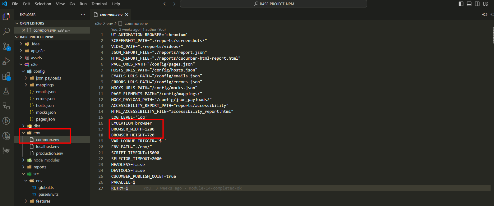

</details>
<br>

[Back to Index](#index)


#### Error helper ts file:

File content:

```ts
import { WaitForTarget, WaitForTargetType, ErrorsConfig } from '../env/global'
import { logger } from '../logger'

export const getErrorSummary = (errDetail: string): string => {
    return errDetail.split('\n')[0];
}

export const parseErrorMessage = (
    errList: ErrorsConfig,
    errorSummary: string,
    targetName: string,
    targetType: string
): string => {
    const targetErrorIndex = errList
        .map(err => RegExp(err.originalErrMsgRegexString))
        .findIndex(errRegex => errRegex.test(errorSummary),)
    return targetErrorIndex > -1
        ? errList[targetErrorIndex].parsedErrMsg.replace(/{}/g, targetName).replace(/<>/g, targetType)
        : errorSummary;
}


export const handleError = (
    errList: ErrorsConfig,
    err: Error,
    target?: WaitForTarget,
    type?: WaitForTargetType
): void => {
    const errorDetail = err?.message ?? ''
    const errorSummary = getErrorSummary(errorDetail)
    const targetName = target ?? ''
    const targetType = type ?? ''

    if (!errList || !errorSummary) {
        logger.error(errorDetail)
        throw new Error(errorDetail)
    }

    const parsedErrorMessage = parseErrorMessage(errList, errorSummary, targetName, targetType)

    logger.error(parsedErrorMessage)
    throw new Error(parsedErrorMessage)
}
```

<details>
<summary>Click to open error-help.ts file description</summary>
<br>

The purpose of this file is to handle and standardize error processing in an automation environment. It provides utility functions to extract the summary from detailed error messages, match errors against predefined patterns, and replace placeholders in error messages with specific target-related information. 

The file also logs and throws errors in a structured manner, ensuring that both known and unknown errors are appropriately captured and reported, enhancing the clarity and consistency of error handling across the automation framework.

**Imports:**

```ts
import { WaitForTarget, WaitForTargetType, ErrorsConfig } from '../env/global'
import { logger } from '../logger'
```
- import { WaitForTarget, WaitForTargetType, ErrorsConfig } from '../env/global':

This imports some type definitions (WaitForTarget, WaitForTargetType, and ErrorsConfig) from the file global.ts (Check the global.ts file if needed) that defines our project's types and configurations. These are used to define the expected structure of the data.

- WaitForTarget and WaitForTargetType: These types represent specific targets that the automation framework interacts with or waits for. WaitForTarget is defined as either a PageId (the ID of a webpage) or an ElementKey (a key referring to an element on the page). WaitForTargetType is a string describing the type of target (perhaps the type of element or action related to the target).

- ErrorsConfig: This is a type that defines a list of error configurations, where each error configuration has:
  - originalErrMsgRegexString: A regex string used to match against the original error message.
  - parsedErrMsg: A parsed, human-friendly error message that replaces placeholders ({} for target names and <> for target types).

- import { logger } from '../logger': The logger object from logger.ts is used for logging different levels of messages (debug, log, error). In this file, it is primarily used to log errors when they occur.

**Function 1:**

```ts
export const getErrorSummary = (errDetail: string): string => {
    return errDetail.split('\n')[0];
}
```
Function Purpose:

The purpose of this function is to extract the "summary" from a multi-line error message. Usually, when an error is thrown, it contains a detailed message spanning multiple lines, but this function grabs only the first line as a summary.

Explanation:

- errDetail: string: This is a parameter that expects a string (the error message).

- split('\n'): This splits the error message into an array of strings, using the newline (\n) character as the separator.

- [0]: This grabs the first line of the error message (index 0 of the array).

- return errDetail.split('\n')[0];: The function returns the first line of the error message.

**Function 2: parseErrorMessage:**

```ts
export const parseErrorMessage = (
    errList: ErrorsConfig,
    errorSummary: string,
    targetName: string,
    targetType: string
): string => {
    const targetErrorIndex = errList
        .map(err => RegExp(err.originalErrMsgRegexString))
        .findIndex(errRegex => errRegex.test(errorSummary),)
    return targetErrorIndex > -1
        ? errList[targetErrorIndex].parsedErrMsg.replace(/{}/g, targetName).replace(/<>/g, targetType)
        : errorSummary;
}
```

Function Purpose:

This function parses a known error and attempts to format it according to a pre-configured list of errors. It checks whether the error message matches any known patterns and replaces placeholders with specific values.

Explanation:

- errList: ErrorsConfig: This is a list of error configurations ErrorsConfig is a type defined in our global.ts file (See errorConfig section in the global.ts file if necessary).

- errorSummary: string: This is the first line of the error message that was previously extracted by getErrorSummary.

- targetName: string and targetType: string: These are placeholders in error messages. For example, {} may be replaced with targetName, and <> may be replaced with targetType.

**Main Logic:**

- errList.map(...): This iterates over the list of errors and creates a regular expression (RegExp) from each error’s pattern.

- .findIndex(...): This function checks which error pattern (regex) matches the errorSummary. It returns the index of the matching error, or -1 if no match is found.

- targetErrorIndex > -1: If a match is found:

- errList[targetErrorIndex].parsedErrMsg: It takes the matched error's parsed message.

- .replace(/{}/g, targetName): It replaces {} in the error message with targetName.

- replace(/<>/g, targetType): It replaces <> with targetType.
If no match is found (targetErrorIndex === -1), it simply returns the errorSummary.

**Function 3: handleError**

```ts
export const handleError = (
    errList: ErrorsConfig,
    err: Error,
    target?: WaitForTarget,
    type?: WaitForTargetType
): void => {
    const errorDetail = err?.message ?? ''
    const errorSummary = getErrorSummary(errorDetail)
    const targetName = target ?? ''
    const targetType = type ?? ''

    if (!errList || !errorSummary) {
        logger.error(errorDetail)
        throw new Error(errorDetail)
    }

    const parsedErrorMessage = parseErrorMessage(errList, errorSummary, targetName, targetType)

    logger.error(parsedErrorMessage)
    throw new Error(parsedErrorMessage)
}
```

Function Purpose:

This function handles an error by logging it and throwing an error with a parsed error message, following the process of finding matching error patterns (from the list of errors).

Explanation:

Parameters:

- errList: ErrorsConfig: List of possible errors and their patterns.
- err: Error: The actual error that occurred.
- target?: WaitForTarget and type?: WaitForTargetType: Optional parameters to give more context about the target and type of error (like what element the error is related to).

**Main Logic:**

- err?.message ?? '': This gets the error message, or an empty string if it's undefined.
- getErrorSummary(errorDetail): Extracts the first line (summary) of the error message using the getErrorSummary function.
- targetName = target ?? '': If target is not provided, default to an empty string.
- targetType = type ?? '': If type is not provided, default to an empty string.

**Error Handling:**

If there's no error list or error summary:

- logger.error(errorDetail): Log the full error message.
- throw new Error(errorDetail): Throw the error with its original message.


If there is a match:

- parsedErrorMessage = parseErrorMessage(...): Parse the error message using the parseErrorMessage function.
- logger.error(parsedErrorMessage): Log the parsed error message.
- throw new Error(parsedErrorMessage): Throw a new error with the parsed message.

**Summary:**
- getErrorSummary: Extracts the first line of a detailed error message.
- parseErrorMessage: Tries to match the error message with known patterns and replaces placeholders with context-specific data.
- handleError: Orchestrates the process of checking if an error matches known patterns, logging the error, and throwing a new error with more detailed information if available.

Each of these functions helps manage errors in our automation tests by standardizing error messages, logging them, and ensuring that appropriate information is displayed when something goes wrong.


</details>
<br>

[Back to Index](#index)


#### Html behavior ts file:

File content:

```ts
import { Page, Frame } from 'playwright';
import { ElementLocator } from '../env/global';
import {ElementHandle} from "@playwright/test";

export const clickElement = async (
    page: Page,
    elementIdentifier: ElementLocator
): Promise<void> => {
    await page.click(elementIdentifier);
};

export const clickElementAtIndex = async(
    page: Page,
    elementIdentifier: ElementLocator,
    elementPosition: number,
): Promise<void> => {
    const element = await page.$(`${elementIdentifier}>>nth=${elementPosition}`)
    await element?.click()
}

export const inputElementValue = async (
    page: Page,
    elementIdentifier: ElementLocator,
    input: string
): Promise<void> => {
    await page.focus(elementIdentifier);
    await page.fill(elementIdentifier, input);
};

export const selectElementValue = async (
    page: Page,
    elementIdentifier: ElementLocator,
    option: string
): Promise<void> => {
    await page.focus(elementIdentifier);
    await page.selectOption(elementIdentifier, option);
};

export const checkElement = async (
    page: Page,
    elementIdentifier: ElementLocator
): Promise<void> => {
    await page.check(elementIdentifier)
}

export const uncheckElement = async (
    page: Page,
    elementIdentifier: ElementLocator
): Promise<void> => {
    await page.uncheck(elementIdentifier)
}

export const inputValueOnIframe =  async (
    elementIframe: Frame,
    elementIdentifier: ElementLocator,
    inputValue: string
): Promise<void> => {
    await elementIframe.fill(elementIdentifier, inputValue)
}

export const inputValueOnPage = async (
    pages: Array<Page>,
    pageIndex: number,
    elementIdentifier: ElementLocator,
    inputValue: string,
): Promise<void> => {
    await pages[pageIndex].focus(elementIdentifier)
    await pages[pageIndex].fill(elementIdentifier, inputValue)
}

export const scrollElementIntoView = async (
    page: Page,
    elementIdentifier: ElementLocator,
): Promise<void> => {
    const element = page.locator(elementIdentifier)
    await element.scrollIntoViewIfNeeded()
}

export const getElement = async (
    page: Page,
    elementIdentifier: ElementLocator,
): Promise<ElementHandle<SVGElement | HTMLElement> | null> => {
    const element = await page.$(elementIdentifier)
    return element
}

export const getElements = async (
    page: Page,
    elementIdentifier: ElementLocator,
): Promise<ElementHandle<SVGElement | HTMLElement>[]> => {
    const elements = await page.$$(elementIdentifier)
    return elements
}

export const getElementAtIndex = async (
    page: Page,
    elementIdentifier: ElementLocator,
    index: number,
): Promise<ElementHandle<SVGElement | HTMLElement> | null> => {
    const elementAtIndex = await page.$(`${elementIdentifier}>>nth=${index}`)
    return elementAtIndex
}

export const getElementValue = async(
    page: Page,
    elementIdentifier: ElementLocator
): Promise<string | null> => {
    const value = await page.$eval<string, HTMLSelectElement>(elementIdentifier, el => {
        return el.value;
    })
    return value;
}

export const getIframeElement = async (
    page: Page,
    iframeIdentifier: ElementLocator
): Promise<Frame | undefined | null> => {
    const elementHandle = await page.$(iframeIdentifier)
    const elementIframe = await elementHandle?.contentFrame()
    return elementIframe
}

export const getElementWithinIframe = async(
    elementIframe: Frame,
    elementIdentifier: ElementLocator,
): Promise<ElementHandle<SVGElement | HTMLElement> | null> => {
    const visibleOnIframeElement = await elementIframe?.$(elementIdentifier)
    return visibleOnIframeElement
}

export const getTextWithinIframeElement = async (
    elementIframe: Frame,
    elementIdentifier: ElementLocator,
): Promise<string | null> => {
    const textOnIframeElement = await elementIframe?.textContent(elementIdentifier)
    return textOnIframeElement
}

export const getTitleWithinPage = async (
    page: Page,
    pages: Array<Page>,
    pageIndex: number,
): Promise<string | null> => {
    const titleWithinPage = await pages[pageIndex].title()
    return titleWithinPage
}

export const getElementOnPage = async(
    page: Page,
    elementIdentifier: ElementLocator,
    pages: Array<Page>,
    pageIndex: number,
): Promise<ElementHandle<SVGElement | HTMLElement> | null> => {
    const elementOnPage = await pages[pageIndex].$(elementIdentifier)
    return elementOnPage
}

export const getElementTextWithinPage = async (
    page: Page,
    elementIdentifier: ElementLocator,
    pages: Array<Page>,
    pageIndex: number,
): Promise<string | null> => {
    const textWithinPage = await pages[pageIndex].textContent(elementIdentifier)
    return textWithinPage
}

export const getAttributeText = async(
    page: Page,
    elementIdentifier: ElementLocator,
    attribute: string,
): Promise<string | null> => {
    const attributeText = page.locator(elementIdentifier).getAttribute(attribute)
    return attributeText
}

export const getElementText = async (
    page: Page,
    elementIdentifier: ElementLocator,
): Promise<string | null> => {
    const text = await page.textContent(elementIdentifier)
    return text
}

export const getElementTextAtIndex = async (
    page: Page,
    elementIdentifier: ElementLocator,
    index: number
): Promise<string | null> => {
    const textAtIndex = await page.textContent(`${elementIdentifier}>>nth=${index}`)
    return textAtIndex
}

export const getTableData = async(
    page: Page,
    elementIdentifier: ElementLocator,
): Promise<string> => {
    const table = await page.$$eval(elementIdentifier+" tbody tr", (rows) => {
        return rows.map(row => {
            const cells = row.querySelectorAll('td')
            return Array.from(cells).map(cell => cell.textContent)
        })
    })
    return JSON.stringify(table)
}

export const elementEnabled = async (
    page: Page,
    elementIdentifier: ElementLocator,
): Promise<boolean | null> => {
    const enabled = await page.isEnabled(elementIdentifier)
    return enabled
}

export const elementChecked = async (
    page: Page,
    elementIdentifier: ElementLocator,
): Promise<boolean | null> => {
    const checked = await page.isChecked(elementIdentifier)
    return checked
}
```

<details>
<summary>Click to open html-behavior.ts file description</summary>
<br>

This file provides a set of utility functions for interacting with elements on a web page in an automation context, for testing purposes. Each function performs a specific action, such as clicking on an element, selecting a value from a dropdown, entering text, scrolling an element into view, or retrieving an element’s value. 

These functions are built with asynchronous behavior to handle page interactions that require waiting, ensuring smooth and reliable automation. The utilities streamline interactions with page elements and iframes, making it easier to write reusable, modular, and maintainable test scripts.

**Imports:**

```ts
import { Page, Frame } from 'playwright';
import { ElementLocator } from '../env/global';
import { ElementHandle } from "@playwright/test";
```
- import { Page, Frame } from 'playwright';: This imports Page and Frame from the Playwright library. A Page represents a single browser tab, and a Frame is an HTML frame (like an iframe element embedded within a page).

- import { ElementLocator } from '../env/global';: This imports ElementLocator, a type or alias defined in our global.ts file to represent a selector (usually a CSS selector) used to identify HTML elements on a page.

- import { ElementHandle } from "@playwright/test";: ElementHandle is a reference to an element in the browser, which allows for interactions and actions (like clicking or getting the text).

**ClickElement:**

```ts
export const clickElement = async (
    page: Page,
    elementIdentifier: ElementLocator
): Promise<void> => {
    await page.click(elementIdentifier);
};
```
- export const clickElement =: This exports the function clickElement so it can be used in other files.

- async: Marks the function as asynchronous, meaning it returns a Promise and allows the use of await inside it.

- (page: Page, elementIdentifier: ElementLocator): Parameters for the function. page is an instance of Page, representing the browser tab. 

- elementIdentifier is a selector (ElementLocator type) that identifies the element to click on.

- : Promise-void: Specifies that the function returns a Promise that doesn't resolve to any specific value (void).

- await page.click(elementIdentifier);: await pauses execution until the click action is complete. 

- page.click() performs the click on the element identified by elementIdentifier.

**ClickElementAtIndex:**

```ts
export const clickElementAtIndex = async(
    page: Page,
    elementIdentifier: ElementLocator,
    elementPosition: number,
): Promise<void> => {
    const element = await page.$(`${elementIdentifier}>>nth=${elementPosition}`);
    await element?.click();
};
```
- export const clickElementAtIndex =: Exports the clickElementAtIndex function.

- async: Allows use of await and makes the function return a Promise.
- (page: Page, elementIdentifier: ElementLocator, elementPosition: number)- : Parameters. page is the browser tab, elementIdentifier is the selector, and elementPosition is the index of the element in a list of matching elements.
- : Promise-void: Indicates that the function returns a Promise without a return value.
- const element = await page.$(...);: Selects a specific element from a list of elements using the nth pseudo-class. await waits for this action to complete before proceeding.
- await element?.click();: If element exists (?. ensures it's not null), it performs a click. This line waits for the click to complete.

**InputElementValue:**

```ts
export const inputElementValue = async (
    page: Page,
    elementIdentifier: ElementLocator,
    input: string
): Promise<void> => {
    await page.focus(elementIdentifier);
    await page.fill(elementIdentifier, input);
};
```
- export const inputElementValue =: Exports inputElementValue.
- async: Makes the function asynchronous.

- (page: Page, elementIdentifier: ElementLocator, input: string): page is the tab, elementIdentifier the selector, and input the text to type.

- : Promise-void: Indicates no return value.

- await page.focus(elementIdentifier);: Focuses on the element (like clicking into a text box), waiting until it’s ready.

- await page.fill(elementIdentifier, input);: Types input into the focused element, waiting until typing is complete.

**SelectElementValue:**

```ts
export const selectElementValue = async (
    page: Page,
    elementIdentifier: ElementLocator,
    option: string
): Promise<void> => {
    await page.focus(elementIdentifier);
    await page.selectOption(elementIdentifier, option);
};
```
- selectElementValue: Selects an option in a dropdown.

- option: string: The option to select.

- await page.focus(elementIdentifier);: Focuses the dropdown.

- await page.selectOption(elementIdentifier, option);: Selects the option.

**CheckElement and UncheckElement:**

```ts
export const checkElement = async (
    page: Page,
    elementIdentifier: ElementLocator
): Promise<void> => {
    await page.check(elementIdentifier);
};

export const uncheckElement = async (
    page: Page,
    elementIdentifier: ElementLocator
): Promise<void> => {
    await page.uncheck(elementIdentifier);
};
```

- checkElement / uncheckElement: Checks or unchecks a checkbox.

- await page.check(...) / await page.uncheck(...): Performs the check/uncheck action.

**InputValueOnIframe:**

```ts
export const inputValueOnIframe =  async (
    elementIframe: Frame,
    elementIdentifier: ElementLocator,
    inputValue: string
): Promise<void> => {
    await elementIframe.fill(elementIdentifier, inputValue);
};
```
- export const inputValueOnIframe = async (...): Defines inputValueOnIframe, which inputs text into an element inside an iframe.

- await elementIframe.fill(...): Fills the element in the iframe with inputValue.

**InputValueOnPage:**

```ts
export const inputValueOnPage = async (
    pages: Array<Page>,
    pageIndex: number,
    elementIdentifier: ElementLocator,
    inputValue: string,
): Promise<void> => {
    await pages[pageIndex].focus(elementIdentifier);
    await pages[pageIndex].fill(elementIdentifier, inputValue);
};
```

-  pages: Array-Page: A list of browser tabs.

-  pageIndex: number: Index of the tab in the list.

-  await pages[pageIndex].focus(...): Focuses the element in the specified tab.

-  await pages[pageIndex].fill(...): Types inputValue.

**scrollElementIntoView:**

```ts
export const scrollElementIntoView = async (
    page: Page,
    elementIdentifier: ElementLocator,
): Promise<void> => {
    const element = page.locator(elementIdentifier);
    await element.scrollIntoViewIfNeeded();
};
```

- scrollElementIntoView: Scrolls the element into view.

- await element.scrollIntoViewIfNeeded(): Scrolls only if not visible.

**GetElement:**

```ts
export const getElement = async (
    page: Page,
    elementIdentifier: ElementLocator,
): Promise<ElementHandle<SVGElement | HTMLElement> | null> => {
    const element = await page.$(elementIdentifier);
    return element;
};
```
- : Promise<ElementHandle<SVGElement | HTMLElement> | null>: Returns an element handle or null.

- await page.$(...): Finds the element on the page.

**GetElements:**

```ts
export const getElements = async (
    page: Page,
    elementIdentifier: ElementLocator,
): Promise<ElementHandle<SVGElement | HTMLElement>[]> => {
    const elements = await page.$$(elementIdentifier)
    return elements
}
```
- Retrieves multiple elements that match a specified selector.

- Parameters: page (the Playwright Page instance), elementIdentifier (the selector of the elements to retrieve).

Return Type: Promise<ElementHandle<SVGElement | HTMLElement>[]> – a promise that resolves to an array of element handles.

Code Explanation: Uses page.$$() to select all matching elements, then returns them.


**getElementAtIndex**

```ts
export const getElementAtIndex = async (
    page: Page,
    elementIdentifier: ElementLocator,
    index: number,
): Promise<ElementHandle<SVGElement | HTMLElement> | null> => {
    const elementAtIndex = await page.$(`${elementIdentifier}>>nth=${index}`);
    return elementAtIndex;
};
```

- export const getElementAtIndex = async (...): Defines getElementAtIndex, which retrieves an element at a specific index.

- const elementAtIndex = await page.$(...): Uses nth to select an element at the specified index.

- return elementAtIndex;: Returns the element handle or null if not found.

**GetElementValue:**

```ts
export const getElementValue = async(
    page: Page,
    elementIdentifier: ElementLocator
): Promise<string | null> => {
    const value = await page.$eval<string, HTMLSelectElement>(elementIdentifier, el => {
        return el.value;
    });
    return value;
};
```
*Purpose:*
This function is designed to extract the value of an element on the page. It's specifically used to retrieve the value of an element that has a value property, such as form input fields (like -input-, -select-, -textarea-), or any other element that holds a value.

*Parameters:*
- page: Page: This is the Playwright Page object that represents the current web page you're interacting with. It provides methods to interact with and query elements on the page.

- elementIdentifier: ElementLocator: This represents the locator used to find the target element on the page. In our case, ElementLocator is a custom type that encapsulates how to locate an element, such as a CSS selector, XPath, or Playwright Locator.

*Function Breakdown:*
await page.$eval<string, HTMLSelectElement>(elementIdentifier, el => {...}):

- page.$eval: This Playwright method allows us to execute a function in the browser context, similar to running JavaScript directly in the page. It's used to query the element and extract some value from it.

- elementIdentifier: This is passed as the first argument to page.$eval. It’s a selector or locator for the element whose value you want to retrieve.

- <string, HTMLSelectElement>: These are TypeScript generics.
The first type (string) specifies the return type of the function that is executed inside the browser context (in this case, it will return a string).

The second type (HTMLSelectElement) defines the type of the element that is being passed to the function inside the browser. This is useful if we're interacting with a specific element type (e.g., -select- dropdown).
- el => { return el.value; }: This is an arrow function that will be executed in the browser context. The el is the element found using elementIdentifier. The function returns el.value, which gets the value property of the element, such as the selected option in a -select> or the entered text in an -input>.

- const value = await ...;:

This line awaits the resolution of the page.$eval function, which returns the value of the element (el.value). This value is then assigned to the value variable.

- return value;:

Finally, the function returns the value that was retrieved from the element. If the element has no value, this could be null.

*Summary:*

This function is used to retrieve the value of a specified element on the page, which is useful when dealing with form fields or other elements that hold user input or selection data. It simplifies interactions with web elements by abstracting the logic of selecting the element and extracting its value in a clean and reusable way.

**getIframeElement**

```ts
export const getIframeElement = async (
    page: Page,
    iframeIdentifier: ElementLocator
): Promise<Frame | undefined | null> => {
    const elementHandle = await page.$(iframeIdentifier);
    const elementIframe = await elementHandle?.contentFrame();
    return elementIframe;
};
```
- export const getIframeElement = async (...): Defines getIframeElement, which retrieves the frame of an iframe element.

- const elementHandle = await page.$(...): Locates the iframe element.

- const elementIframe = await elementHandle?.contentFrame();: Gets the frame content of the iframe.

- return elementIframe;: Returns the iframe frame or null if not found.

**getElementWithinIframe**

```ts
export const getElementWithinIframe = async(
    elementIframe: Frame,
    elementIdentifier: ElementLocator,
): Promise<ElementHandle<SVGElement | HTMLElement> | null> => {
    const visibleOnIframeElement = await elementIframe?.$(elementIdentifier);
    return visibleOnIframeElement;
};
```

- export const getElementWithinIframe = async (...): Defines getElementWithinIframe, which retrieves an element within an iframe.

- const visibleOnIframeElement = await elementIframe?.$(...): Locates the element within the specified elementIframe.

- return visibleOnIframeElement;: Returns the element handle or null.

**getTextWithinIframeElement**

```ts
export const getTextWithinIframeElement = async (
    elementIframe: Frame,
    elementIdentifier: ElementLocator,
): Promise<string | null> => {
    const textOnIframeElement = await elementIframe?.textContent(elementIdentifier);
    return textOnIframeElement;
};
```

- export const getTextWithinIframeElement = async (...): Defines getTextWithinIframeElement, which retrieves text content from an element inside an iframe.

- const textOnIframeElement = await elementIframe?.textContent(...): Retrieves the text content.

- return textOnIframeElement;: Returns the text or null.

**getTitleWithinPage**

```ts
export const getTitleWithinPage = async (
    page: Page,
    pages: Array<Page>,
    pageIndex: number,
): Promise<string | null> => {
    const titleWithinPage = await pages[pageIndex].title();
    return titleWithinPage;
};
```
- export const getTitleWithinPage = async (...): Defines getTitleWithinPage, which retrieves the title of a specific page.

- const titleWithinPage = await pages[pageIndex].title();: Gets the title of the page at pageIndex.

- return titleWithinPage;: Returns the title.

**getElementOnPage**

```ts
export const getElementOnPage = async(
    page: Page,
    elementIdentifier: ElementLocator,
    pages: Array<Page>,
    pageIndex: number,
): Promise<ElementHandle<SVGElement | HTMLElement> | null> => {
    const elementOnPage = await pages[pageIndex].$(elementIdentifier);
    return elementOnPage;
};
```
*Purpose:*
The purpose of this function is to retrieve a specific element from a page within an array of pages based on the provided pageIndex. This is useful in cases where you are working with multiple pages and want to interact with an element on a specific one.

*Parameters:*

- elementIdentifier: ElementLocator: This is a custom type that specifies the locator (such as a CSS selector or XPath) used to identify the element we're looking for on the page.

- pages: Array-Page>: This is an array of Playwright Page objects. Each page corresponds to a different tab or browser context, and this array allows the function to interact with multiple pages at once.

- pageIndex: number: This is the index of the page in the pages array that we want to interact with. It specifies which page to extract the element from.

*Function Breakdown:*

const elementOnPage = await pages[pageIndex].$(elementIdentifier);:

- pages[pageIndex]: This accesses the specific page from the pages array using the provided pageIndex. This allows the function to work with the correct page, especially when dealing with multiple tabs or browser contexts.

- $(elementIdentifier): This is a Playwright method used to query the page for an element. It uses the elementIdentifier (which is a locator) to find the element matching that selector on the specific page. The $ method returns a Promise that resolves to an ElementHandle representing the element found, or null if no element matching the selector is found.

- ElementHandle<SVGElement | HTMLElement>: This indicates that the function expects the result to be an element handle that corresponds to an HTML or SVG element. An ElementHandle is a reference to an element on the page, which allows us to interact with it (click, retrieve attributes, etc.).

- return elementOnPage;:

The function returns the elementOnPage, which is either the ElementHandle for the matched element or null if no element was found. The ElementHandle allows us to perform further actions on the element (like clicking, reading text, etc.).

**getElementTextWithinPage**

```ts
export const getElementTextWithinPage = async (
    page: Page,
    elementIdentifier: ElementLocator,
    pages: Array<Page>,
    pageIndex: number,
): Promise<string | null> => {
    const textWithinPage = await pages[pageIndex].textContent(elementIdentifier);
    return textWithinPage;
};
```
- export const getElementTextWithinPage = async (...): Defines getElementTextWithinPage, which retrieves text from an element on a specified page.

- const textWithinPage = await pages[pageIndex].textContent(...): Retrieves the text content.

- return textWithinPage;: Returns the text.

**getAttributeText**

```ts
export const getAttributeText = async(
    page: Page,
    elementIdentifier: ElementLocator,
    attribute: string,
): Promise<string | null> => {
    const attributeText = page.locator(elementIdentifier).getAttribute(attribute);
    return attributeText;
};
```
- export const getAttributeText = async (...): Defines getAttributeText, which retrieves a specific attribute’s value from an element.

- const attributeText = page.locator(...).getAttribute(...): Locates the element and gets the attribute.

- return attributeText;: Returns the attribute’s value or null.

**getElementText**

```ts
export const getElementText = async (
    page: Page,
    elementIdentifier: ElementLocator,
): Promise<string | null> => {
    const text = await page.textContent(elementIdentifier);
    return text;
};
```
- export const getElementText = async (...): Defines getElementText, which retrieves text content from an element.

- const text = await page.textContent(...): Gets the text content.

- return text;: Returns the text.

**getElementTextAtIndex**

```ts
export const getElementTextAtIndex = async (
    page: Page,
    elementIdentifier: ElementLocator,
    index: number
): Promise<string | null> => {
    const textAtIndex = await page.textContent(`${elementIdentifier}>>nth=${index}`);
    return textAtIndex;
};
```
- export const getElementTextAtIndex = async (...): Defines getElementTextAtIndex, which retrieves text from an element at a specific index.

- const textAtIndex = await page.textContent(...): Retrieves the text content.

- return textAtIndex;: Returns the text.

**getTableData**

```ts
export const getTableData = async(
    page: Page,
    elementIdentifier: ElementLocator,
): Promise<string> => {
    const table = await page.$$eval(elementIdentifier+" tbody tr", (rows) => {
        return rows.map(row => {
            const cells = row.querySelectorAll('td');
            return Array.from(cells).map(cell => cell.textContent);
        });
    });
    return JSON.stringify(table);
};
```
*Purpose:*
The purpose of this function is to extract data from an HTML table on the page. Specifically, it retrieves the data from all the rows of the table (excluding the header), returning it in a structured format (as a JSON string). This is useful when you want to extract the contents of a table for validation or further processing in our tests.

*Parameters:*

- page: Page: The Playwright Page object, representing the page we want to interact with. This object provides methods to interact with and query elements on the page.

- elementIdentifier: ElementLocator: A custom type used to identify the table on the page. This could be a CSS selector (like #myTable) or another valid Playwright locator that points to the -table> element.

*Function Breakdown:*

const table = await page.$$eval(elementIdentifier + " tbody tr", (rows) => {...});

- page.$$eval(): This method evaluates a function in the context of the page and is used to query multiple elements based on the provided selector. The $$eval method is used when we want to query multiple elements that match the selector (in this case, all the rows in the table body). It takes two arguments:
    - elementIdentifier + " tbody tr": This is the CSS selector used to select all the rows (-tr>) inside the -tbody> of the table identified by elementIdentifier. This assumes the table data is inside a -tbody>, which is the typical structure of a table.

    - (rows) => {...}: This is an arrow function that will be executed in the browser context. It receives the matched elements (the rows of the table) as an argument and processes them.

- rows.map(row => {...}):

The rows parameter contains an array of the -tr> elements inside the -tbody> of the table. The map() function is used to iterate over each row in the table body and process it.

- const cells = row.querySelectorAll('td');:

    - row.querySelectorAll('td'): For each row, the function selects all the <td> (table data) elements inside the row. This returns a NodeList of the table cells in that row.

- Array.from(cells).map(cell => cell.textContent);:

    - Array.from(cells): Converts the NodeList of <td> elements into a JavaScript array so that it can be used with array methods like map().

    - .map(cell => cell.textContent): This processes each <td> element in the row, extracting its textContent. The textContent property of an element returns the text content inside the element (i.e., the cell’s content).

This results in an array of the text contents of the cells for that row.

- return JSON.stringify(table);:

    - Once all rows are processed, the map() function returns an array of arrays. Each inner array contains the text content of the cells in that row.

    - JSON.stringify(table): The entire table data is converted into a JSON string. This makes it easier to return and use the data in other parts of our program (such as assertions in tests).


**elementEnabled**

```ts
export const elementEnabled = async (
    page: Page,
    elementIdentifier: ElementLocator,
): Promise<boolean | null> => {
    const enabled = await page.isEnabled(elementIdentifier);
    return enabled;
};
```
- export const elementEnabled = async (...): Defines elementEnabled, which checks if an element is enabled.

- const enabled = await page.isEnabled(...): Uses isEnabled to check if the element is interactable.

- return enabled;: Returns true, false, or null.

**elementChecked**

```ts
export const elementChecked = async (
    page: Page,
    elementIdentifier: ElementLocator,
): Promise<boolean | null> => {
    const checked = await page.isChecked(elementIdentifier);
    return checked;
};
```
- export const elementChecked = async (...): Defines elementChecked, which checks if a checkbox or radio is checked.

- const checked = await page.isChecked(...): Uses isChecked to get the element’s checked state.

- return checked;: Returns true, false, or null.

**Conclusion**:

We created all this HTML behavior functions, to use in our future test actions and assertions:

- clickElement
- clickElementAtIndex
- inputElementValue
- selectElementValue
- checkElement
- uncheckElement
- inputValueOnIframe
- inputValueOnPage
- scrollElementIntoView
- getElement
- getElements
- getElementAtIndex
- getElementValue
- getIframeElement
- getElementWithinIframe
- getTextWithinIframeElement
- getTitleWithinPage
- getElementOnPage
- getElementTextWithinPage
- getAttributeText
- getElementText
- getElementTextAtIndex
- getTableData
- elementEnabled
- elementChecked

At anytime, we can create new ones if we need.


</details>
<br>

[Back to Index](#index)


#### Input helper ts file

File content:

```ts
import { GlobalConfig } from '../env/global'

const isLookupVariable = (input: string, lookupTrigger: string): boolean => {
    return !!(lookupTrigger && input.startsWith(lookupTrigger))
}

const getLookupVariable = (input: string, lookupTrigger: string, config: GlobalConfig): string => {
    const key = input.substr(lookupTrigger.length)
    const lookupValue = config.emailsConfig[key] ?? process.env[key]

    if (!lookupValue) {
        throw Error(`Could not get ${input} lookup trigger`)
    }

    return lookupValue
}

export const parseInput = (input: string, config: GlobalConfig): string => {
    const lookupTrigger = process.env.VAR_LOOKUP_TRIGGER ?? '$.'
    return isLookupVariable(input, lookupTrigger) ? getLookupVariable(input, lookupTrigger, config): input;
}

```

<details>
<summary>Click to open input-helper.ts file description</summary>
<br>

The purpose of the input-helper.ts file is to parse and handle special "lookup variables" in input strings. If an input string starts with a specified prefix (like $.), the file interprets it as a key for looking up a value in a configuration object (GlobalConfig) or environment variables. This allows the program to dynamically replace certain inputs with predefined values, enabling flexible and configurable data handling across different environments. If the input doesn't match the lookup pattern, it's returned as-is.

*File: input-helper.ts:*

```ts
import { GlobalConfig } from '../env/global';
```
- Explanation: This line imports the GlobalConfig type from the global.ts file. By importing this type, we can use it to define the structure and requirements for a config object that we’ll pass into some functions in this file.

- Why It’s Needed: Using GlobalConfig ensures that any config object passed into functions in this file has all the expected properties (like emailsConfig, pagesConfig, etc.) defined in global.ts.

*Function 1: isLookupVariable:*

```ts
const isLookupVariable = (input: string, lookupTrigger: string): boolean => {
    return !!(lookupTrigger && input.startsWith(lookupTrigger));
}
```
*Explanation of Each Part:*

- Purpose: This function checks if an input string starts with a specific prefix called lookupTrigger.

*Parameters:*

- input: string: The string we want to check. This could be a variable name or identifier.

- lookupTrigger: string: A prefix that, if present at the start of input, indicates that input is a "lookup variable".

- Return Type: boolean – This function returns either true or false, indicating whether input starts with lookupTrigger.

*Line-by-Line Breakdown:*

- lookupTrigger && input.startsWith(lookupTrigger)

This checks two things:

- First: If lookupTrigger is not empty or undefined. If lookupTrigger is an empty string or undefined, the whole condition will return false.

- Second: If input starts with the lookupTrigger prefix.
!!(...)
!! converts the result to a boolean (true or false). This is helpful if the expression inside could return something that isn’t strictly a boolean (like null or undefined).

- Overall Purpose: isLookupVariable returns true if input starts with lookupTrigger, meaning it’s a "lookup variable" (a variable that requires looking up a value based on the prefix).

*Function 2: getLookupVariable:*

```ts
const getLookupVariable = (input: string, lookupTrigger: string, config: GlobalConfig): string => {
    const key = input.substr(lookupTrigger.length);
    const lookupValue = config.emailsConfig[key] ?? process.env[key];

    if (!lookupValue) {
        throw Error(`Could not get ${input} lookup trigger`);
    }

    return lookupValue;
}
```

*Explanation of Each Part:*

- Purpose: This function extracts a "key" from input and then looks up a corresponding value in the emailsConfig section of the config object or in environment variables.

*Parameters:*

- input: string: The lookup variable string (e.g., $emailExample), where $ is the lookupTrigger.

- lookupTrigger: string: The prefix used to identify lookup variables (e.g., $).

- config: GlobalConfig: The main configuration object, expected to have a structure as defined in global.ts.

- Return Type: string – This function returns the looked-up value as a string. If no value is found, it throws an error.

*Line-by-Line Breakdown:*

```ts
const key = input.substr(lookupTrigger.length);
```

- Explanation: This extracts the part of input after the lookupTrigger.

Example: If input is $emailExample and lookupTrigger is $, then key would become "emailExample".

```ts
const lookupValue = config.emailsConfig[key] ?? process.env[key];
```

- Explanation: This line attempts to find the value associated with key.
First: It looks up key in config.emailsConfig, which is a section in the GlobalConfig type intended to store email configurations.

- Fallback: If config.emailsConfig[key] doesn’t exist, it checks process.env[key], which accesses environment variables.

- Purpose: This setup allows flexibility: if the value isn’t found in the configuration object, it tries to get it from the environment variables.

```ts
if (!lookupValue) { throw Error(...); }
```

- Explanation: If neither config.emailsConfig nor process.env contains a value for key, the function throws an error, indicating that the lookup failed.

- Purpose: This ensures the function only returns a value if one exists. If no value is found, it gives a clear error message.

```ts
return lookupValue;
```

- Explanation: If lookupValue was successfully found, it is returned as the function result.

*Function 3: parseInput:*

```ts
export const parseInput = (input: string, config: GlobalConfig): string => {
    const lookupTrigger = process.env.VAR_LOOKUP_TRIGGER ?? '$.';
    return isLookupVariable(input, lookupTrigger) ? getLookupVariable(input, lookupTrigger, config) : input;
}
```
*Explanation of Each Part:*

- Purpose: This function takes an input string and determines if it’s a lookup variable. If it is, it retrieves the corresponding value; if it isn’t, it simply returns input as-is.

*Parameters:*

- input: string: The string we want to parse, which might be a lookup variable.

- config: GlobalConfig: The configuration object that provides data for lookups.

- Return Type: string – This function returns the final parsed value of input.

*Line-by-Line Breakdown:*~

```ts
const lookupTrigger = process.env.VAR_LOOKUP_TRIGGER ?? '$.';
```

- Explanation: This line sets lookupTrigger, the prefix used to identify lookup variables.

- Primary: It checks if process.env.VAR_LOOKUP_TRIGGER is set (this is an environment variable). If so, it uses that as the lookupTrigger.

- Fallback: If VAR_LOOKUP_TRIGGER isn’t set, it defaults to "$.".

- Purpose: Using process.env.VAR_LOOKUP_TRIGGER allows for flexibility; users can change the trigger prefix through environment settings.

```ts
return isLookupVariable(input, lookupTrigger) ? getLookupVariable(input, lookupTrigger, config) : input;
```

- Explanation: This line is a conditional statement (using ? :, known as the ternary operator).

- First Condition: isLookupVariable(input, lookupTrigger): Checks if input is a lookup variable by seeing if it starts with lookupTrigger.

- If True: getLookupVariable(input, lookupTrigger, config): Calls getLookupVariable to retrieve the corresponding value.

- If False: input: Returns input as it is, without modification.

- Purpose: This conditional flow ensures that only lookup variables (starting with lookupTrigger) are processed, while others are returned unchanged.

*Summary:*

- This file provides helper functions for processing "lookup variables" in input strings.
- GlobalConfig (from global.ts) is used to look up values in emailsConfig or environment variables.
- parseInput is the main function that checks if input is a lookup variable and either retrieves the associated value or returns input as-is.

These functions allow for flexible, configurable inputs in the project, enabling lookup of dynamic values based on prefixes. Let me know if you have more questions about any part!

</details>
<br>

[Back to Index](#index)

#### mock behavior ts file:

File content:

```ts
import { Page } from 'playwright'
import {
    GlobalConfig,
    MockConfigKey,
    MockServerKey,
    MockPayloadKey,
} from '../env/global'

export const interceptResponse = async (
    page: Page,
    mockServerKey: MockServerKey,
    mockConfigKey: MockConfigKey,
    mockPayloadKey: MockPayloadKey,
    { hostsConfig, mocksConfig, mockPayloadMappings }: GlobalConfig
): Promise<void> => {
    const mockServerHostURL = hostsConfig[mockServerKey]
    const mockServerRoute = mocksConfig[mockConfigKey]
    const mockServerPayload = mockPayloadMappings[mockPayloadKey]

    if (!mockServerPayload) {
        throw Error(`🧨 Unable to find the ${mockPayloadKey} payload json file 🧨`)
    }

    await page.route(`${mockServerHostURL}${mockServerRoute}`, (route) =>
        route.fulfill({
            contentType: 'application/json',
            body: JSON.stringify(mockServerPayload)
        }))
}
```
<details>
<summary>Click to open mock-behavior.ts file description</summary>
<br>

The mock-behavior.ts file is designed to intercept network requests in a Playwright-based testing framework. It dynamically responds to those requests with mocked data instead of allowing them to hit a live server. This is useful for testing how the application behaves with specific responses without needing the actual server to be up or respond in real-time. The file allows customization of different mock responses based on various configurations, improving test reliability and performance.

*Imports:*

```ts
import { Page } from 'playwright'
import {
    GlobalConfig,
    MockConfigKey,
    MockServerKey,
    MockPayloadKey,
} from '../env/global'
```

- import { Page } from 'playwright':
This line imports the Page type from Playwright. A Page represents a browser tab and is used to control and interact with the browser during tests. In this context, it will be used to apply the route interception for mocking network requests.

- import { GlobalConfig, MockConfigKey, MockServerKey, MockPayloadKey } from '../env/global':
This line imports types from the global.ts file. These types define the structure and allowed values for the configuration keys that are passed into the interceptResponse function:

    - GlobalConfig: The overall configuration object that contains details like mock payload mappings, host URLs, and other settings.
    - MockConfigKey: A type for keys related to mock server routes.
    - MockServerKey: A type for keys that represent mock server URLs.
    - MockPayloadKey: A type for keys that represent specific mock payloads.

*interceptResponse Function:*

```ts
export const interceptResponse = async (
    page: Page,
    mockServerKey: MockServerKey,
    mockConfigKey: MockConfigKey,
    mockPayloadKey: MockPayloadKey,
    { hostsConfig, mocksConfig, mockPayloadMappings }: GlobalConfig
): Promise<void> => {
```
- export const interceptResponse = async:
This is defining an asynchronous function named interceptResponse that will intercept network requests. It is exported so it can be used in other files.

- page: Page:
The function takes a Page object as an argument. This represents the browser page (or tab) that will be used to intercept network requests.

- mockServerKey: MockServerKey, mockConfigKey: MockConfigKey, mockPayloadKey: MockPayloadKey:
These are keys that reference specific configurations:

    - mockServerKey refers to the mock server's URL.
    - mockConfigKey refers to the route or endpoint that needs to be mocked.
    - mockPayloadKey refers to the specific mock data that will be returned for the network request.

- { hostsConfig, mocksConfig, mockPayloadMappings }: GlobalConfig:
This destructures the GlobalConfig object into its properties:

    - hostsConfig: Contains URLs for mock servers.
    - mocksConfig: Contains the specific routes that will be mocked.
    - mockPayloadMappings: Contains the actual mock data for each endpoint.

- Promise-void>:
The function is asynchronous and doesn't return a value (hence void).

*Inside the Function:*

```ts
    const mockServerHostURL = hostsConfig[mockServerKey]
    const mockServerRoute = mocksConfig[mockConfigKey]
    const mockServerPayload = mockPayloadMappings[mockPayloadKey]
```
- const mockServerHostURL = hostsConfig[mockServerKey]:
This line retrieves the URL of the mock server from the hostsConfig object using the mockServerKey. The key is a string, and it maps to a URL in the configuration.

- const mockServerRoute = mocksConfig[mockConfigKey]:
This line retrieves the route or endpoint to mock from the mocksConfig object using the mockConfigKey.

- const mockServerPayload = mockPayloadMappings[mockPayloadKey]:
This line retrieves the mock data from the mockPayloadMappings object using the mockPayloadKey. The data is expected to be in the form of a JSON payload that will be returned when the mock route is hit.

*Error Handling:*

```ts
    if (!mockServerPayload) {
        throw Error(`🧨 Unable to find the ${mockPayloadKey} payload json file 🧨`)
    }
```
This checks if mockServerPayload is undefined or falsy (meaning there was no matching payload for the provided mockPayloadKey). If the payload is not found, it throws an error with a descriptive message.

*Intercepting the Request:*

```ts
    await page.route(`${mockServerHostURL}${mockServerRoute}`, (route) =>
        route.fulfill({
            contentType: 'application/json',
            body: JSON.stringify(mockServerPayload)
        }))
```
- await page.route(...):
This tells Playwright to intercept network requests that match a specific URL pattern (mockServerHostURL + mockServerRoute). When such a request is made, the provided callback function will be executed.

- ${mockServerHostURL}${mockServerRoute}:
This combines the mock server URL and the route to form the full URL that will be intercepted.

- (route) => route.fulfill(...):
This is a callback function that Playwright will call whenever a matching request is intercepted. The route object represents the intercepted request, and route.fulfill(...) is used to provide a mock response.

- contentType: 'application/json':
This sets the content type of the mocked response to 'application/json', indicating that the response will contain JSON data.

- body: JSON.stringify(mockServerPayload):
This sets the body of the mocked response. It converts the mock payload (which is an object) into a JSON string using JSON.stringify(). The mockServerPayload is the data that will be returned when the request is intercepted.

**Summary of the file:**

The mock-behavior.ts file intercepts network requests made by the application during testing and returns mocked responses instead. This is done to ensure the application behaves in a predictable way for testing, even if external services or endpoints are unavailable or unreliable. By using mock data, tests become more stable and independent from external systems.

</details>
<br>

[Back to Index](#index)


#### Wait for behavior ts file

File content:

```ts
import {
  Frame,
  Page
} from "playwright"
import {
  ElementLocator,
  GlobalConfig,
  WaitForTarget,
  WaitForTargetType
} from "../env/global"
import { envNumber } from "../env/parseEnv"
import {handleError} from "./error-helper";
import {logger} from "../logger";

export const enum waitForResult {
  PASS = 1,
  FAIL = 2,
  ELEMENT_NOT_AVAILABLE=3
}

export type waitForResultWithContext = {
  result: waitForResult
  replace?: string
}

export const waitFor = async <T>(
  predicate: () => waitForResult | Promise<waitForResult> | waitForResultWithContext | Promise<waitForResultWithContext>,
  globalConfig: GlobalConfig,
  options?: { timeout?: number; wait?: number; target?: WaitForTarget; type?: WaitForTargetType, failureMessage?: string }
): Promise<void> => {
  const { timeout = 10000, wait = 2000, target = '', type = 'element' } = options || {};

  const sleep = (ms: number) => new Promise(resolve => setTimeout(resolve, ms));
  const startDate = new Date();
  let notAvailableContext: string | undefined

  try {
    while (new Date().getTime() - startDate.getTime() < timeout) {
      const result = await predicate();
      let resultAs: waitForResult

      if ((result as waitForResultWithContext).result) {
        notAvailableContext = (result as waitForResultWithContext).replace
        resultAs = (result as waitForResultWithContext).result
      } else {
        resultAs = result as waitForResult
      }

      if (resultAs === waitForResult.PASS) {
        return
      } else if (resultAs === waitForResult.FAIL) {
        throw new Error(options?.failureMessage || "Test assertion failed")
      }

      await sleep(wait);
      logger.debug(`Waiting ${wait}ms`);
    }
    throw new Error(`Wait time of ${timeout}ms for ${notAvailableContext || target} exceeded`);
  } catch (error) {
    handleError(globalConfig.errorsConfig, error as Error, target, type)
  }
};

export const waitForSelector = async (
    page: Page,
    elementIdentifier: ElementLocator
): Promise<boolean> => {
  try {
    await page.waitForSelector(elementIdentifier, {
      state: 'visible',
      timeout: envNumber('SELECTOR_TIMEOUT')
    })
    return true
  } catch (e) {
    return false
  }
}

export const waitForSelectorOnPage = async (
    page: Page,
    elementIdentifier: ElementLocator,
    pages: Array<Page>,
    pageIndex: number
): Promise<boolean> => {
  try {
    await pages[pageIndex].waitForSelector(elementIdentifier,{
      state: 'visible',
      timeout: envNumber('SELECTOR_TIMEOUT')
    })
    return true
  } catch (e) {
    return false
  }
}

export const waitForSelectorInIframe = async(
    elementIframe: Frame,
    elementIdentifier: ElementLocator,
): Promise<boolean> => {
  try {
    await elementIframe?.waitForSelector(elementIdentifier, {
      state: 'visible',
      timeout: envNumber('SELECTOR_TIMEOUT')
    })
    return true
  } catch (e) {
    return false
  }

}
```
<details>
<summary>Click to open wait-for-behavior.ts file description</summary>
<br>

This file contains various helper functions that assist in waiting for specific elements or conditions to appear on the page or within iframes. These utilities are particularly useful for handling asynchronous operations in a Playwright-based automation test framework. The functions are designed to wait for elements to become visible or perform checks in a structured way, allowing the test to proceed only once the desired conditions are met. It also includes error handling in case the wait time exceeds the set threshold or if any other issues arise during the waiting process.

*Imports:*

```ts
import { Frame, Page } from "playwright"
import { ElementLocator, GlobalConfig, WaitForTarget, WaitForTargetType } from "../env/global"
import { envNumber } from "../env/parseEnv"
import { handleError } from "./error-helper"
import { logger } from "../logger"
```
- import { Frame, Page } from "playwright":

    - This imports Frame and Page from the Playwright library. These types are used to represent browser pages and frames, which allow interactions and tests to be performed in the browser context.

- import { ElementLocator, GlobalConfig, WaitForTarget, WaitForTargetType } from "../env/global":

    - This imports types and configurations from global.ts. These include types for element locators (ElementLocator), global configuration (GlobalConfig), and waiting conditions (WaitForTarget and WaitForTargetType).

- import { envNumber } from "../env/parseEnv":

    - This imports the envNumber function, which is used to retrieve environment variables and ensure they are returned as numbers (e.g., timeout values).

- import { handleError } from "./error-helper":

    - This imports a utility function handleError from error-helper.ts to handle errors during execution.

- import { logger } from "../logger":

    - This imports the logger to allow logging of information (e.g., waiting times, error messages) during the test execution.

*waitForResult Enum:*

*An enum declaration in TypeScript (and other programming languages) is a way to define a set of named constants, often referred to as enumeration members. These constants are typically related and represent a fixed set of possible values for a variable.
Enums make our code more readable, structured, and type-safe by replacing "magic values" (like numbers or strings) with meaningful names.*

```ts
export const enum waitForResult {
  PASS = 1,
  FAIL = 2,
  ELEMENT_NOT_AVAILABLE = 3
}
```
- export const enum waitForResult {...}:
This is an enum declaration in TypeScript that defines possible outcomes for waiting operations:

    - PASS (1): The condition was successfully met.
    - FAIL (2): The condition failed.
    - ELEMENT_NOT_AVAILABLE (3): The element was not available within the expected time.

```ts
export type waitForResultWithContext = {
  result: waitForResult
  replace?: string
}
```

This code defines a TypeScript type called waitForResultWithContext

- TypeScript type Definition:

    - waitForResultWithContext is a custom type.
    - It specifies the structure of an object that contains two properties: result and an optional replace.

- result: waitForResult:

    - Property Name: result
    - Type: waitForResult
        - waitForResult is another type or enum defined above in our code.
        - It represents the status of some operation (e.g., PASS, FAIL, or similar outcomes).

- replace?: string:

    - Property Name: replace
    - Type: string
    - Optional (?):

        - The replace property may or may not be present on objects of this type.

    - Purpose:
        - Stores additional context or a specific message to replace or augment standard information.

- Usage Example:

    - Objects of type waitForResultWithContext must always have a result, but the replace property is optional.

*waitFor Function:*

```ts
export const waitFor = async <T>(
  predicate: () => waitForResult | Promise<waitForResult> | waitForResultWithContext | Promise<waitForResultWithContext>,
  globalConfig: GlobalConfig,
  options?: { timeout?: number; wait?: number; target?: WaitForTarget; type?: WaitForTargetType, failureMessage?: string }
): Promise<void> => {
```
- export const waitFor:

    - export makes this function available outside this module, so it can be used in other files.

    - const declares this function as a constant, meaning waitFor cannot be reassigned.

    - The function is an async function, meaning it will return a Promise, enabling asynchronous operations within the function.
T
- Type Parameters -T>:

    - -T> is a generic type parameter. It’s included to make waitFor flexible in handling various types. While T isn’t explicitly used within this function, it gives flexibility for future enhancements if additional types need to be introduced.

*Parameters:*

- predicate:

    - This is a function that returns a condition we want to check repeatedly.
    - predicate can return:
        - waitForResult (an enum to represent different outcomes: PASS, FAIL, ELEMENT_NOT_AVAILABLE)
        - waitForResultWithContext (an object with extra context information alongside waitForResult)
        - Or Promise versions of these values, which allow predicate to execute asynchronous code.

    - predicate is expected to return a value that helps us decide whether we can stop waiting or should keep checking.

- globalConfig: GlobalConfig:

    - globalConfig is an object that contains configuration settings used globally across the project.
    - This could include settings like error-handling configurations, potentially imported from a settings file.

- options?: { ... }:
    - options is an optional parameter (indicated by the ?) that allows fine-tuning how waitFor should behave.
    - options is an object that can have:
        - timeout: Maximum time in milliseconds that waitFor should keep checking the predicate before giving up. Default is set to 10000 (10 seconds).
        - wait: Delay in milliseconds between each check. Default is 2000 (2 seconds).
        - target and type: Metadata that describe what waitFor is waiting for, such as an element’s name (target) and its type (type, e.g., “element”). These can help in logging or error handling.
        - failureMessage: A custom message to throw in case the wait fails (useful for debugging).

- : Promise-void>:

    - The return type of the function is Promise<void>, which means it does not resolve to any value (void) but allows asynchronous operations.
    - If all checks pass, the function completes silently; if there’s an error or timeout, the promise will reject with an error.

**Summary of the Code:**

This waitFor function is a utility designed to run an asynchronous loop, checking a specific condition (predicate) until it either succeeds, fails, or reaches a specified timeout. The added options (timeout, wait, etc.) make it customizable for various conditions and flexible for many different types of waiting scenarios in an automation testing framework. The use of the GlobalConfig parameter allows for consistent error handling, and the function is particularly helpful for dealing with asynchronous events or waiting for specific elements or states in Playwright.

**Extracting Options:**

```Ts
  const { timeout = 10000, wait = 2000, target = '', type = 'element' } = options || {};
```
This line uses destructuring with default values to extract and set values from the options object. Here’s a breakdown of how it works and what each part does:

- const:
    - Declares a constant variable to hold the destructured values. This means these extracted values (timeout, wait, target, type) cannot be reassigned within this function.

- { timeout = 10000, wait = 2000, target = '', type = 'element' }:
    - This is object destructuring with default values. It extracts properties from the options object and, if a property is not provided, assigns a default value instead.

Here’s what each extracted variable represents:

- timeout = 10000:
    - Extracts the timeout property from options.
    - If options.timeout is undefined, it defaults to 10000, meaning 10,000 milliseconds (or 10 seconds).
    - This value represents the maximum time to keep checking the predicate before stopping.

- wait = 2000:
    - Extracts the wait property from options.
    - If options.wait is undefined, it defaults to 2000, meaning 2,000 milliseconds (or 2 seconds).
    - This is the delay between each check. So, every 2 seconds, the function will re-evaluate the predicate function until either a passing condition is met or the timeout is reached.

- target = '':
    - Extracts the target property from options.
    - If options.target is undefined, it defaults to an empty string ('').
    - target is metadata, representing the specific element or item the function is waiting for. This can be useful for logging or error messages (e.g., if you’re waiting for a button to appear, target could be set to "Submit Button").

- type = 'element':
    - Extracts the type property from options.
    - If options.type is undefined, it defaults to the string 'element'.
    - This provides additional context, describing what kind of item the function is waiting for. Typical values could be element, attribute, or other specific types in the context of the test.
    - This can also be helpful for error handling or logging by providing more detailed information on the type of item involved in the wait condition.

- = options || {};:
    - options || {} is a fallback in case options is not provided.
    - If options is undefined or null, it defaults to an empty object {}.
    - This ensures that destructuring can proceed without errors, even if options was never passed.

**Sleep Helper Function:**

```ts
const sleep = (ms: number) => new Promise(resolve => setTimeout(resolve, ms));
```
This line of code defines a helper function called sleep, which introduces a delay (or pause) for a specified number of milliseconds. This is commonly used in asynchronous programming to temporarily halt execution, allowing time for certain actions to complete before continuing.

- const sleep =:
    - This declares a constant function named sleep. Since it’s a constant, this function reference cannot be changed or reassigned in this scope.

- (ms: number):
    - This specifies that sleep accepts one argument named ms, which is of type number.
    - The ms parameter stands for milliseconds and indicates how long the function should wait or pause. For instance, if you want a 2-second delay, you would pass 2000 (since 1000 milliseconds equals 1 second).

- => new Promise(...):
    - This is an arrow function returning a new Promise.
    - A Promise in JavaScript (and TypeScript) is a construct that represents an operation that will complete in the future, either successfully or with a failure.
    - By using a Promise, sleep becomes an asynchronous function, meaning it can be awaited in other parts of our code, allowing the code to pause at this function until the specified delay is over.

- resolve => setTimeout(resolve, ms):
    - Inside the Promise constructor, we provide a function with a single parameter called resolve.
    - resolve is a function provided by the Promise system that, when called, marks the promise as completed or "resolved."
    - setTimeout is a built-in JavaScript function that executes a function after a specified delay, given in milliseconds.
    - Here, setTimeout is given resolve as the function to execute after ms milliseconds. When resolve is called, it completes the promise, allowing the await sleep(ms) line to move on to the next line of code after the delay.

**Start Time and Context:**

```ts
const startDate = new Date();
let notAvailableContext: string | undefined;
```

These two lines are setting up variables that are essential for tracking the start time and handling any error context if the target element or condition isn’t found within the allowed timeframe.

- const startDate = new Date();

**Purpose:**
 This line captures the exact date and time when the waitFor function starts executing. The value of startDate is then used to track how long the function has been running.

- Details:
    - new Date() creates a new Date object representing the current date and time at the exact moment this line of code executes.
    - const startDate = assigns this Date object to a constant named startDate. This ensures the recorded start time doesn’t change, allowing for accurate measurement of elapsed time.
    - In this context, startDate helps determine if the waitFor function is running longer than the maximum allowed timeout (specified in the options), which would mean the target condition hasn’t been met within the allotted time.

- How it’s used:
    - Later in the waitFor function, you’ll see a comparison between the current time and startDate. By subtracting startDate from the current time, you can check if the allowed timeout has been exceeded.
    - This is especially useful in long-running asynchronous loops or waiting mechanisms, where precise tracking of elapsed time is crucial.

- let notAvailableContext: string | undefined;

**Purpose:**
 This line defines a variable, notAvailableContext, that will store information related to the target element or condition if it’s not found within the timeout period.

- Details:
    - let is used here, allowing notAvailableContext to be reassigned later in the function.
    -The type is string | undefined, which means that notAvailableContext can either hold a string value or be undefined.
        - string: This will hold a context message, indicating which element or condition couldn’t be found, making error messages more informative.
        - undefined: The variable is initially undefined, indicating that no context message is available until it’s set.
    - The notAvailableContext variable is often set when the waitFor function checks a condition and determines that the target isn’t available. For instance, if an element or condition fails to load, notAvailableContext can hold the name or identifier of that element.

- How it’s used:
    - If the waitFor function times out before the condition is met, this variable can be included in the error message, providing more context about what went wrong.
    - When debugging or logging, notAvailableContext can help developers understand which part of the code or element failed to load, allowing for more precise troubleshooting.

**Try-Catch Block:**

```ts
  try {
    while (new Date().getTime() - startDate.getTime() < timeout) {
      const result = await predicate();
```
This section of code sets up a loop that repeatedly checks if a specified condition has been met, pausing the loop once the condition is fulfilled or a timeout is reached. Here’s a detailed breakdown of what each part is doing:

- try {
    - Purpose: The try block initiates error handling. It surrounds the loop and any other code that might throw an error within this function.

    - Details:
        - If an error occurs anywhere inside this try block, the catch section (found later in the code) will handle it.
        - Using try here helps manage any unexpected failures while waiting for the condition to pass. For example, if predicate() encounters an error, this structure ensures the error won’t crash the program but will be caught and handled gracefully.

- while (new Date().getTime() - startDate.getTime() < timeout) {
    - Purpose: This line creates a loop that will keep running as long as the current elapsed time is less than the specified timeout.

    - Details:
        - while is a type of loop that runs as long as the condition inside its parentheses remains true.
        - Inside the while condition, the expression new Date().getTime() - startDate.getTime() < timeout calculates how much time has passed since startDate.
            - new Date().getTime() returns the current time in milliseconds.
            - startDate.getTime() is the start time recorded earlier in milliseconds.
            - Subtracting startDate.getTime() from new Date().getTime() gives the elapsed time in milliseconds.
            - The loop will continue if the elapsed time is still less than the timeout. As soon as the elapsed time exceeds the timeout, the loop will stop.
        - In effect, this loop tries to check the specified condition (predicate) repeatedly within a certain timeframe (up to the timeout limit).
        - Why it’s useful: By continuously looping up to the timeout limit, this function allows for waiting until a condition becomes true without waiting indefinitely.

- const result = await predicate();
    - Purpose: This line runs the predicate function (an action or condition check passed to waitFor), and it waits for its result each time the loop runs.

    - Details:
        - const result = assigns the outcome of the predicate function to the variable result.
        - await predicate() pauses the function until predicate() completes and returns a value.
            - The predicate function is a callback function expected to return either a simple waitForResult or a waitForResultWithContext (defined types that signal if the condition was successful, failed, or not available).
        - await ensures the code waits for predicate() to finish before moving to the next line, which is crucial for asynchronous operations that don’t finish immediately.
        - Each time predicate() is called, it checks a certain condition, such as whether an element is visible or a variable has reached a specific value.
            - If the condition is true (e.g., an element becomes visible), predicate would return waitForResult.PASS.
            - If the condition fails or times out, it might return waitForResult.FAIL or waitForResult.ELEMENT_NOT_AVAILABLE, signaling that the loop should either stop or keep trying.

**Summary:**

This section forms the core of the timeout-based condition check:
- It sets up a while loop that will keep running until either:
    - The specified condition is fulfilled.
    - The timeout duration has elapsed.
- It repeatedly calls predicate() (the condition-checking function) and waits for its response (result), allowing the loop to check the condition at each iteration without prematurely ending or waiting indefinitely.

This structure is essential for scenarios where a web page may take varying amounts of time to load elements or fulfill specific conditions, allowing the code to react flexibly while maintaining a strict time limit.

**Processing the Predicate Result:**

```ts
let resultAs: waitForResult
if ((result as waitForResultWithContext).result) {
  notAvailableContext = (result as waitForResultWithContext).replace
  resultAs = (result as waitForResultWithContext).result
} else {
  resultAs = result as waitForResult
}
```
This code snippet is handling the different possible formats of the result returned by the predicate function. Since result can be either a waitForResult or a waitForResultWithContext, this code determines which type of result was returned, extracts relevant information, and normalizes it to a single type (waitForResult). Let’s go through each line in detail.

- 1. let resultAs: waitForResult
Purpose: Declares a variable resultAs with the type waitForResult, which is used to store the normalized outcome of the predicate function.

        - Details:

        - let allows resultAs to be reassigned within this code block.
        - Declaring resultAs as type waitForResult enforces that, regardless of the original type (waitForResult or waitForResultWithContext), the final value stored in resultAs will always be one of the standardized results: PASS, FAIL, or ELEMENT_NOT_AVAILABLE.

- 2. if ((result as waitForResultWithContext).result) {
Purpose: Checks if result is of type waitForResultWithContext, meaning it contains additional context information.

        - Details:

        - The expression (result as waitForResultWithContext).result casts result to type waitForResultWithContext and tries to access its result property.
        - In TypeScript, as is a type assertion. It tells TypeScript to treat result as a waitForResultWithContext temporarily to access its properties.
        - If result has a result property, it indicates that result is indeed a waitForResultWithContext type, not a simple waitForResult.
        - The if condition will execute if result includes additional context (i.e., it’s a waitForResultWithContext).

- 3. notAvailableContext = (result as waitForResultWithContext).replace
    - Purpose: If result is a waitForResultWithContext, this line assigns the replace property of result to notAvailableContext.

        - Details:

        - (result as waitForResultWithContext).replace casts result to the waitForResultWithContext type and accesses its replace property.
        - replace contains a message or identifier for additional context when the condition isn’t met (e.g., describing why an element isn’t available).
        - Assigning this to notAvailableContext saves this extra context, allowing it to be referenced later (e.g., for logging or error messages).

- 4. resultAs = (result as waitForResultWithContext).result
    - Purpose: This line assigns the result property of the waitForResultWithContext object to resultAs.

        - Details:

        - Since we know result is a waitForResultWithContext, (result as waitForResultWithContext).result accesses its result property.
        - This result property will hold a waitForResult value (e.g., PASS, FAIL, or ELEMENT_NOT_AVAILABLE), and assigning it to resultAs normalizes it for further processing.
        - After this line, resultAs will contain a standardized result that can be used to determine if the condition was met.

- 5. else { resultAs = result as waitForResult }
    - Purpose: If result isn’t a waitForResultWithContext, it must be a simple waitForResult. This line assigns result directly to resultAs.

        - Details:

        - result as waitForResult casts result as a waitForResult type.
        - This covers the case where predicate() returned only a waitForResult, without any additional context.
        - resultAs will now contain the standardized result (PASS, FAIL, or ELEMENT_NOT_AVAILABLE) directly from result.

**Summary:**

- This code block checks whether the predicate function returned a basic result (waitForResult) or an extended result with context (waitForResultWithContext). 
- If result includes extra context, it stores the replace message in notAvailableContext and assigns the standardized result to resultAs. 
- If no extra context is present, it assigns the result directly to resultAs. - This way, resultAs can be used in the remainder of the code to determine the next action based on a standardized condition-checking result.


**Handling Result States:**

```Ts
if (resultAs === waitForResult.PASS) {
  return;
} else if (resultAs === waitForResult.FAIL) {
  throw new Error(options?.failureMessage || "Test assertion failed");
}
```

This part of the code is the core logic that evaluates the result of the predicate function and decides whether the waitFor function should continue, exit successfully, or throw an error.

Here, resultAs is the result of the predicate function. It has been processed earlier in the code to ensure it is a valid waitForResult value. The possible values for resultAs are defined in an enum like this:

```Ts
enum waitForResult {
  PASS, // Represents success
  FAIL, // Represents failure
  ELEMENT_NOT_AVAILABLE, // Could be another possible result (handled outside this block)
}
```

**Condition 1: PASS:**

```ts
if (resultAs === waitForResult.PASS) {
  return;
}
```

- resultAs === waitForResult.PASS:
    - This means the predicate function evaluated the condition successfully (e.g., an element was found, or a specific condition was met).
return:
- Exits the waitFor function immediately because the desired outcome has been achieved.
- The function does not proceed to any further retries or logic.

**Condition 2: FAIL:**

```Ts
else if (resultAs === waitForResult.FAIL) {
  throw new Error(options?.failureMessage || "Test assertion failed");
}
```
- resultAs === waitForResult.FAIL:

    - This means the predicate function evaluated the condition and determined that it failed. The failure is final and cannot be resolved by retrying (e.g., an assertion explicitly failed, or a test condition was definitively not met).

- throw new Error(...):

    - Throws an error immediately to indicate the failure to the calling code. This stops execution of the waitFor function and passes the error up the call stack.

- Error Message:

    - options?.failureMessage: If a custom failureMessage was provided in the options object, it uses that as the error message.
    - Default Message: If no failureMessage is specified, it defaults to "Test assertion failed".

- Purpose:

    - This mechanism ensures the test or operation fails gracefully with clear messaging when the desired condition is definitively unachievable.

**Wait Before Next Check and error:**

```ts
await sleep(wait);
logger.debug(`Waiting ${wait}ms`);
}
throw new Error(`Wait time of ${timeout}ms for ${notAvailableContext || target} exceeded`);
} catch (error) {
handleError(globalConfig.errorsConfig, error as Error, target, type);
}
};
```
1. await sleep(wait);

    - Purpose:

        - This introduces a delay before retrying the predicate function.
        - The delay duration is determined by the wait parameter, specified in milliseconds.

    - How it works:

        - The sleep function is defined earlier:

```ts
const sleep = (ms: number) => new Promise(resolve => setTimeout(resolve, ms));
```
- This creates a promise that resolves after the specified time (ms).
- By using await, the execution pauses here for the duration of wait.

    - Why?

        - In many scenarios (e.g., waiting for an element to appear), conditions take time to change. The wait period gives the system time to reach the desired state before retrying the operation.

2. logger.debug(\Waiting ${wait}ms`);

    - Purpose:

        - Logs a message to indicate how long the function is pausing between retries.
        - Useful for debugging or troubleshooting why the function is taking time or how often it is retrying.

    - How it works:

        - The logger.debug method outputs a debug-level log.
        - The message includes the wait duration in milliseconds, formatted using a template literal.

    - Why?

        - For automation scripts, timing issues are common (e.g., page load delays). This log provides insights into how long the function waited, helping you identify inefficiencies or adjust the wait/timeout parameters.

3. throw new Error(\Wait time of ${timeout}ms for ${notAvailableContext || target} exceeded`);

    - Purpose:

        - If the total time elapsed (timeout) has been exceeded and the predicate function never returned PASS, the function throws an error.

    - How it works:

        - The code calculates the elapsed time during the retry loop:
```ts        
new Date().getTime() - startDate.getTime()
```

If this exceeds timeout, it exits the loop and throws an error with a clear message.

- Error Message:

    - The message includes:

        - timeout: The total time allowed for the operation (in milliseconds).
        - notAvailableContext || target:
            - : A string set earlier in the code (e.g., to indicate what wasn’t found).
            - target: A fallback identifier for what the function was waiting for.

    - Example: "Wait time of 10000ms for submit-button exceeded"

- Why?

    - If the desired condition isn’t met within the allowed time, the function needs to report failure. Throwing an error ensures the failure propagates to the calling code or the surrounding try-catch.

4. catch (error) {

    - Purpose:

        - Captures any error that occurs during the retry process (including the one thrown above).
        - Ensures the error is handled appropriately rather than crashing the script abruptly.

    - How it works:

        - The try block wraps the main logic of waitFor, including the predicate calls and the retry loop.
        - If an error occurs (e.g., timeout, unexpected issue), it is caught here for further processing.

5. handleError(globalConfig.errorsConfig, error as Error, target, type);

    - Purpose:

        - Passes the caught error to the handleError function for structured handling and logging.
        - This allows consistent error processing across our automation framework.

    - Parameters Passed:

        - globalConfig.errorsConfig:

            - A configuration object that defines how errors should be handled (e.g., mapping error messages, retry strategies).

        - error as Error:
            - The error object from the catch block, explicitly cast to Error type for clarity.

        - target:
            - The identifier for what the function was waiting for (e.g., an element or condition).

        - type:
            - The type of the target (e.g., 'element'), providing additional context for error handling.

    - Why?

        - Centralized error handling ensures that all errors are processed, logged, and potentially rethrown in a consistent manner. This makes debugging easier and reduces the risk of missed issues.

    - What Happens After handleError?

        - Depending on how handleError is implemented, it may:

            - Log the error with additional details (e.g., parsed error messages, stack traces).
            - Re-throw the error, causing the script to fail gracefully.
            - Suppress the error (e.g., for non-critical issues), allowing the script to continue.

**Summary:**

- Retry Loop: The code waits (sleep) between retries, logging each delay (logger.debug).
- Timeout Handling: If the total wait time exceeds the timeout value, an error is thrown with detailed information.
- Error Management: The catch block ensures all errors (expected or unexpected) are processed through the handleError function, maintaining consistent error handling in our framework.

**Wait for Selector function:**

```Ts
export const waitForSelector = async (
    page: Page,
    elementIdentifier: ElementLocator
): Promise<boolean> => {
  try {
    await page.waitForSelector(elementIdentifier, {
      state: 'visible',
      timeout: envNumber('SELECTOR_TIMEOUT')
    })
    return true
  } catch (e) {
    return false
  }
}
```
1. page: Page,

    - What it is:

        - The first argument, page, is a Playwright Page object.
        - Represents the browser page (or tab) on which the script will perform actions or queries.

    - Why?

        - This is required to interact with the web page in Playwright.
        - All element-related operations (e.g., finding, clicking) are performed using the Page object.

2. elementIdentifier: ElementLocator

    - What it is:

        - The second argument, elementIdentifier, is a locator for the target element.
        - This can be a CSS selector, XPath, or another type of locator supported by Playwright.

    - Why?

        - To identify and operate on specific elements in the DOM.

    - Example:

        - If elementIdentifier = '#submit-button', the function will check for the visibility of the element with id="submit-button".

3. try {

    - Purpose:

        - Wraps the logic in a try block to handle potential errors gracefully.

    - Why?

        - Operations like page.waitForSelector can fail (e.g., the element is not found or doesn't become visible within the timeout).
        - The catch block ensures the function does not crash the script in case of failure.

4. await page.waitForSelector(elementIdentifier, {

    - Purpose:

        - The function waits for the element identified by elementIdentifier to meet specific conditions (state: 'visible').
        - This is an asynchronous operation, so the await keyword is used to pause execution until the element is visible or the timeout is reached.

    - How it works:

        - page.waitForSelector is a Playwright method that:
            - Searches for the element in the DOM using the given elementIdentifier.
            - Waits for the element to satisfy the specified state condition.

5. state: 'visible',

    - What it means:

        - Specifies that the element must be visible to satisfy the condition.

        - Visible means:
            - The element exists in the DOM.
            - The element has a non-zero size (width > 0 and height > 0).
            - The element is not hidden (e.g., via display: none or visibility: hidden).

    - Why?

        - To ensure the element is ready for user interaction or further testing.

6. timeout: envNumber('SELECTOR_TIMEOUT')

    - What it is:

        - Specifies the maximum time (in milliseconds) to wait for the element to become visible.
        - The timeout value is fetched dynamically using envNumber('SELECTOR_TIMEOUT').

    - What is envNumber?

        - A helper function that retrieves and parses an environment variable.

    - Why?

        - Different test environments may require different timeouts (e.g., slower environments may need a longer timeout).

    - Example:

        - If process.env.SELECTOR_TIMEOUT = '10000', the timeout will be set to 10 seconds.

7. return true

    - When it runs:

        - If the await page.waitForSelector call succeeds (i.e., the element becomes visible within the timeout), the function returns true.

    - Why?

        - Indicates that the element is visible, signaling success to the caller.

8. } catch (e) {

    - When it runs:

        - If an error occurs during the await page.waitForSelector call, the catch block is executed.

    - What errors might occur?

        - The element doesn’t exist in the DOM.
        - The element is not visible within the timeout period.
        - Other unexpected issues during execution.

    - Why?

        - Ensures the script handles errors gracefully instead of crashing.

9. return false

    - When it runs:

        - If the try block throws an error (e.g., the element is not found or not visible), the function returns false.

    - Why?

        - Signals to the caller that the element is not visible.
        - Allows the caller to decide the next steps (e.g., retrying or logging an error).

**Summary:**

- This function provides a simple, reusable way to check for the visibility of an element:

    - Waits for the element to become visible within a configurable timeout.
    - Returns true if successful.
    - Returns false if the timeout is exceeded or an error occurs.
    - Helps avoid unhandled errors and provides flexibility to the caller.

**Wait for selector on page function:**

```Ts
export const waitForSelectorOnPage = async (
    page: Page,
    elementIdentifier: ElementLocator,
    pages: Array<Page>,
    pageIndex: number
): Promise<boolean> => {
  try {
    await pages[pageIndex].waitForSelector(elementIdentifier,{
      state: 'visible',
      timeout: envNumber('SELECTOR_TIMEOUT')
    })
    return true
  } catch (e) {
    return false
  }
}
```
1. Function Declaration

```ts
export const waitForSelectorOnPage = async (
    page: Page,
    elementIdentifier: ElementLocator,
    pages: Array<Page>,
    pageIndex: number
): Promise<boolean> => {
```

- What it is:

    - Declares an asynchronous function named waitForSelectorOnPage.
    - Exported so it can be imported and used in other parts of the project.

 - Arguments:

    - page: Page:
         - Represents the active Playwright Page object, possibly redundant in this function (used to maintain consistency with the signature of similar utilities).
    - elementIdentifier: ElementLocator:
        - A locator to identify the target element on the page (e.g., CSS selector, XPath, etc.).

    - pages: ArrayPage>:
        - An array of Page objects, representing multiple browser tabs, popups, or frames opened during the test.

    - pageIndex: number:
        - The index of the specific page within the pages array to search for the element.

- Returns:

    - A Promiseboolean>:
        - Resolves to true if the element becomes visible.
        - Resolves to false if the element is not found or doesn't meet the visibility criteria within the timeout.

2. try {

    - Purpose:

        - Ensures any runtime errors (e.g., element not found, invalid page index) are handled gracefully.

    - Why?

        - Prevents crashes when dealing with asynchronous operations or invalid inputs.

3. await pages[pageIndex].waitForSelector(elementIdentifier, {

    - What it does:

        - Accesses the specific Page object from the pages array using pageIndex.
        - Calls the waitForSelector method on that Page to wait for the element identified by elementIdentifier to meet specific visibility conditions.

    - Key Points:

        - pages[pageIndex]:
            - Accesses the desired page (tab or frame) from the pages array.
            - If the index is invalid (e.g., out of bounds), the code will throw an error.

    - waitForSelector:
        - Waits for the element to be visible on the page.

    - Arguments:

        - elementIdentifier:
            - The locator of the element to be checked.

    - Options:
        - state: 'visible':
            - Ensures the element is visible on the page (exists in the DOM, not hidden, and has dimensions).

    - timeout: envNumber('SELECTOR_TIMEOUT'):
        - Specifies the maximum time (in milliseconds) to wait for the element.

4. state: 'visible',

    - What it means:

        - Waits for the element to become visible on the page.

    - Visibility Criteria:

        - The element exists in the DOM.
        - It has non-zero dimensions.
        - It is not hidden by display: none or visibility: hidden.

5. timeout: envNumber('SELECTOR_TIMEOUT')

    - Purpose:

        - Specifies how long to wait for the element before timing out.

    - How envNumber Works:

        - Fetches an environment variable (e.g., SELECTOR_TIMEOUT) and converts it to a number.

    - Why?

        - Allows dynamic configuration of timeout values for different environments (e.g., faster timeouts for local tests, slower for CI).

    - Example:

        - If SELECTOR_TIMEOUT = 10000 (10 seconds), the function waits up to 10 seconds for the element to become visible.

6. return true

    - What it does:

        - If waitForSelector succeeds (the element becomes visible), the function returns true.

    - Why?

        - Indicates successful visibility of the element to the caller.

7. } catch (e) {

    - What it does:

        - Executes when an error occurs in the try block.

    - What errors might occur?

        - pageIndex is out of bounds (e.g., pages[pageIndex] doesn’t exist).
        - The element doesn’t meet the visible condition within the timeout.
        - Other unexpected runtime errors.

    - Why?

        - Handles these errors gracefully without crashing the script.

8. return false

    - What it does:

        - If the try block fails, the function returns false.

    - Why?

        - Signals to the caller that the element is either not visible or the operation failed.

**Summary:**

- The waitForSelectorOnPage function enhances flexibility by allowing you to target specific pages in a multi-tab or multi-frame scenario:

    - Waits for an element to become visible on a specific page.
    - Handles timeouts and invalid indices gracefully.
    - Returns true if successful, false otherwise.
    - Helps manage complex multi-page test scenarios effectively.


**Wait for selector in Iframe function:**

```Ts
export const waitForSelectorInIframe = async(
    elementIframe: Frame,
    elementIdentifier: ElementLocator,
): Promise<boolean> => {
  try {
    await elementIframe?.waitForSelector(elementIdentifier, {
      state: 'visible',
      timeout: envNumber('SELECTOR_TIMEOUT')
    })
    return true
  } catch (e) {
    return false
  }

}
```

1. Function Declaration

```ts
export const waitForSelectorInIframe = async (
    elementIframe: Frame,
    elementIdentifier: ElementLocator,
): Promiseboolean> => {
```

- What it is:

     - Declares an asynchronous function named waitForSelectorInIframe.
    - Exported so it can be used in other modules.

- Arguments:

    - elementIframe: Frame:

        - Represents the Playwright Frame object, which provides context for interacting with content inside an iframe.
        - Must point to the iframe where the element resides.

    - elementIdentifier: ElementLocator:
        - A locator to identify the target element inside the iframe (e.g., CSS selector, XPath, etc.).

- Returns:

    - A Promiseboolean>:

        - Resolves to true if the element becomes visible within the iframe.
        - Resolves to false if the element is not found or doesn't meet the visibility criteria within the timeout.

2. try {

    - Purpose:

        - Ensures that errors (e.g., iframe not available, element not found) are handled gracefully.

    - Why?

        - Avoids crashes due to unhandled exceptions during asynchronous operations.

3. await elementIframe?.waitForSelector(elementIdentifier, {

    - What it does:

        - Waits for the element identified by elementIdentifier to meet specific visibility conditions within the provided iframe (elementIframe).

    - Key Points:

        - elementIframe:
            - Represents the Playwright Frame object.
            - The ?. (optional chaining) ensures the function does not throw an error if elementIframe is undefined or null. Instead, it skips the operation and proceeds with the catch block.

        - waitForSelector:
            - Similar to its usage on a Page object, this method waits for an element to meet the specified state (e.g., visible) within the iframe.

    - Arguments:

        - elementIdentifier:
            - Locator for the element being checked.

    - Options:
        - state: 'visible':
            - Waits for the element to become visible in the iframe.
        - timeout: envNumber('SELECTOR_TIMEOUT'):
            - Specifies the maximum time (in milliseconds) to wait for the element.

4. state: 'visible'

    - What it means:

        - Ensures the element exists in the iframe's DOM, is not hidden, and has dimensions.

    - Visibility Criteria:

        - Exists in the iframe’s DOM.
        - Has non-zero dimensions.
        - Is not hidden via display: none or visibility: hidden.

5. timeout: envNumber('SELECTOR_TIMEOUT')

    - Purpose:

        - Limits how long the function waits for the element to meet the visible condition.

    - How envNumber Works:

        - Fetches a timeout value from an environment variable (e.g., SELECTOR_TIMEOUT) and converts it to a number.

    - Why?

        - Allows for dynamic configuration of the timeout based on the environment.

    - Example:

        - If SELECTOR_TIMEOUT = 5000 (5 seconds), the function waits up to 5 seconds for the element to become visible in the iframe.

6. return true

    - What it does:

        - If the waitForSelector operation succeeds (i.e., the element becomes visible), the function returns true.

    - Why?

        - Indicates successful visibility of the element to the caller.

7. } catch (e) {

    - What it does:

        - Executes if an error occurs in the try block.

    - What errors might occur?

        - elementIframe is undefined or null (optional chaining avoids immediate failure, but nothing happens).
        - The element doesn’t meet the visible condition within the timeout.
        - Other runtime errors, such as invalid locators.

    - Why?

        - Handles errors gracefully without crashing the script.

8. return false

    - What it does:

        - If the try block fails (due to timeout or another error), the function returns false.
~
    - Why?

        - Signals to the caller that the element is either not visible or the operation failed.

**Summary:**

- The waitForSelectorInIframe function:

    - Waits for an element inside a specified iframe to become visible.
    - Returns true if successful, false otherwise.
    - Gracefully handles errors, including timeouts and invalid iframe references.
    - Provides a reusable utility for tests involving iframe interactions.

</details>
<br>

[Back to Index](#index)


#### Navigation behavior ts file

File content:

```ts
import { Page } from 'playwright';
import {GlobalConfig, GlobalVariables, PageId} from '../env/global';
import {waitForResult} from "./wait-for-behavior";

export const navigateToPage = async (
    page: Page,
    pageId: PageId,
    { pagesConfig, hostsConfig }: GlobalConfig
): Promise<void> => {
    const {
        UI_AUTOMATION_HOST: hostName = 'localhost',
    } = process.env;

    const hostPath = hostsConfig[`${hostName}`];

    const url = new URL(hostPath);

    const pageConfigItem = pagesConfig[pageId];
    url.pathname = pageConfigItem.route;

    await page.goto(url.href);
};

const pathMatchesPageId = (
    path: string,
    pageId: PageId,
    { pagesConfig }: GlobalConfig
): boolean => {
    const pageRegexString = pagesConfig[pageId].regex
    const pageRegex = new RegExp(pageRegexString)
    return pageRegex.test(path)
};

export const currentPathMatchesPageId = (
    page: Page,
    pageId: PageId,
    globalConfig: GlobalConfig
): waitForResult => {
    const { pathname: currentPath } = new URL(page.url())
    if (pathMatchesPageId(currentPath, pageId, globalConfig)) {
        return waitForResult.PASS
    }
    return waitForResult.ELEMENT_NOT_AVAILABLE
};

export const getCurrentPageId = (
    page: Page,
    globalConfig: GlobalConfig
): PageId => {
    const { pagesConfig } = globalConfig;

    const pageConfigPageIds = Object.keys(pagesConfig);

    const { pathname: currentPath } = new URL(page.url());

    const currentPageId = pageConfigPageIds.find(pageId =>
        pathMatchesPageId(currentPath, pageId, globalConfig)
    );

    if (!currentPageId) {
        throw Error(
            `Failed to get page name from current route ${currentPath}, \
      possible pages: ${JSON.stringify(pagesConfig)}`
        );
    }

    return currentPageId;
};

export const reloadPage = async (page: Page): Promise<void> => {
    await page.reload()
}
```
<details>
<summary>Click to open navigation-behavior.ts file description</summary>
<br>

This file provides utility functions for managing navigation and URL validation in the test automation framework. The functions handle tasks such as navigating to a specific page, verifying if the current page matches an expected identifier, and retrieving the current page's ID based on the route.


*Imports:*

```ts
import { Page } from 'playwright';
import { GlobalConfig, GlobalVariables, PageId } from '../env/global';
import { waitForResult } from "./wait-for-behavior";
```

1. import { Page } from 'playwright';

    - Playwright provides tools to interact with web browsers programmatically. The Page class represents a single browser tab or iframe.

    - Purpose: This allows the code to control and interact with web pages, such as navigating URLs or accessing page content.

  
2. import { GlobalConfig, GlobalVariables, PageId } from '../env/global';


    - These are type definitions (from global.ts) used to structure data. For example:
        - GlobalConfig: Contains mappings for page routes, hosts, etc.
        - PageId: Represents unique identifiers for pages.

    - Purpose: To provide type safety and ensure consistent use of configuration objects.

3. import { waitForResult } from "./wait-for-behavior";

    - This imports an enumeration from our Wait-for-behavior.ts file to handle different wait results (e.g., success, failure, or unavailability).

    - Purpose: To integrate logic for waiting or checking page readiness.

*Navigate to page funcion:*

```ts
export const navigateToPage = async (
    page: Page,
    pageId: PageId,
    { pagesConfig, hostsConfig }: GlobalConfig
): Promise<void> => {
    const {
        UI_AUTOMATION_HOST: hostName = 'localhost',
    } = process.env;

    const hostPath = hostsConfig[`${hostName}`];

    const url = new URL(hostPath);

    const pageConfigItem = pagesConfig[pageId];
    url.pathname = pageConfigItem.route;

    await page.goto(url.href);
};
```

- This function navigates to a specific page in our test environment using Playwright by constructing a URL dynamically based on:

    - The environment (e.g., staging, production) through hostsConfig.
    - The page identifier (e.g., HomePage, CheckoutPage) through pagesConfig.
    - This ensures flexibility and environment-agnostic navigation without hardcoding URLs.


*Function Signature:*

```ts
export const navigateToPage = async (
    page: Page,
    pageId: PageId,
    { pagesConfig, hostsConfig }: GlobalConfig
): Promise<void> => { ... }
```

*Parameters:*

- page: Page:

    - A Playwright Page object that represents the current browser tab or frame. This is the interface through which all interactions with the web page occur (e.g., navigation, clicks).

- pageId: PageId:

    - A unique identifier (usually a string or enum) that corresponds to a specific page in our pagesConfig object.

- { pagesConfig, hostsConfig }: GlobalConfig:

    - Destructured from GlobalConfig, which contains mappings for:
        - pagesConfig: Details about the routes for each page, such as /checkout or /home.
        - hostsConfig: The base URLs for different environments (e.g., https://staging.example.com).

*Return Value:*

- Promisevoid>:
    - The function is asynchronous because it interacts with the browser (page.goto()), which involves network operations. It doesn’t return any value, but it ensures the browser is navigated to the desired page.


**Step-by-Step Breakdown:**

1. Extracting the Host Name

```ts
const { UI_AUTOMATION_HOST: hostName = 'localhost' } = process.env;
```

- What It Does:

    - This line reads the environment variable UI_AUTOMATION_HOST (e.g., staging, production, or localhost). If the variable is not set, it defaults to 'localhost'.

- Why It's Needed:

    - Environment variables allow us to dynamically configure the host (base URL) without modifying the code. This is especially useful when running tests in different environments (e.g., CI/CD pipelines, local development).

2. Getting the Host Path

```ts
const hostPath = hostsConfig[`${hostName}`];
```

- What It Does:

    - Looks up the hostsConfig object using the extracted hostName. For example:

```ts
const hostsConfig = {
    localhost: 'http://localhost:3000',
    staging: 'https://staging.example.com',
    production: 'https://www.example.com'
};
```

- If hostName is 'staging', hostPath will be 'https://staging.example.com'.

    - Why It's Needed:

        - To construct the full URL, the function needs the base URL (e.g., protocol, domain, and port).

3. Creating the URL Object

```ts
const url = new URL(hostPath);
```

- What It Does:
    - Creates a new URL object using the hostPath. For example:

```ts
const url = new URL('https://staging.example.com');
```

- A URL object makes it easy to manipulate different parts of the URL (e.g., pathname, searchParams).

    - Why It's Needed:
        - This object simplifies appending the page-specific route (e.g., /checkout) to the base URL.

4. Fetching the Route for the Specified Page


```ts
const pageConfigItem = pagesConfig[pageId];
url.pathname = pageConfigItem.route;
```
- What It Does:

    - pagesConfig[pageId]:
        - Retrieves the configuration for the specified pageId. For example:


```ts
const pagesConfig = {
    HomePage: { route: '/' },
    CheckoutPage: { route: '/checkout' },
};
```
- If pageId is 'CheckoutPage', pageConfigItem will be { route: '/checkout' }.

- url.pathname = pageConfigItem.route:
    - Updates the pathname of the URL object with the route for the specific page.

**Example:**

Original URL: https://staging.example.com
After updating: https://staging.example.com/checkout

- Why It's Needed:
    - The route is appended to the base URL to form the full URL for navigation.

5. Navigating to the URL

```ts
await page.goto(url.href);
```

- What It Does:
    - The goto() method instructs the Playwright Page object to navigate to the constructed URL. For example:

```ts
await page.goto('https://staging.example.com/checkout');
```

- Why It's Needed:
    - This is the actual step where the browser is directed to the specified page.

- How It Works:
    - The page.goto() method waits for the navigation to complete before resolving. It can also be configured with additional options (e.g., timeouts).


*pathMatchesPageId funcion:*

```ts
const pathMatchesPageId = (
    path: string,
    pageId: PageId,
    { pagesConfig }: GlobalConfig
): boolean => {
    const pageRegexString = pagesConfig[pageId].regex
    const pageRegex = new RegExp(pageRegexString)
    return pageRegex.test(path)
};
```
- The function checks if a given path (URL or a part of it) matches a specific page's identifier (pageId) by testing the path against a pre-defined regular expression in the pagesConfig configuration.

- This is useful for determining if a user is on the correct page based on the current path.


*Function Signature:*

```ts
const pathMatchesPageId = (
    path: string,
    pageId: PageId,
    { pagesConfig }: GlobalConfig
): boolean => { ... }
```

*Parameters:*

- path: string:
    - The URL path (e.g., /checkout, /products/123) that you want to check.

- pageId: PageId:
    - A unique identifier (e.g., CheckoutPage, HomePage) corresponding to a specific page.

- { pagesConfig }: GlobalConfig:
    - Destructured from GlobalConfig, it contains mappings for the configurations of all pages, including their routes and regular expressions.

- Return Value:
    - boolean:
        - Returns true if the provided path matches the regular expression defined for the pageId; otherwise, false.

**Step-by-Step Breakdown:**

1. Fetching the Page-Specific Regex String

```ts
const pageRegexString = pagesConfig[pageId].regex;
```

- What It Does:
    - Retrieves the regular expression string for the given pageId from pagesConfig.

For example, if the pagesConfig looks like this:

```ts
const pagesConfig = {
    CheckoutPage: { route: '/checkout', regex: '^/checkout$' },
    ProductPage: { route: '/products/:id', regex: '^/products/\\d+$' },
};
```

And the pageId is 'CheckoutPage', pageRegexString will be '^/checkout$'.

- Why It's Needed:
    - Each page has a regex pattern that describes what paths it matches. The function needs to use this pattern to validate the path.

2. Creating a Regular Expression Object

```ts
const pageRegex = new RegExp(pageRegexString);
```

- What It Does:
    - Converts the pageRegexString (a plain string) into a JavaScript RegExp object. For example:

```ts
const pageRegex = new RegExp('^/checkout$');
```

- Why It's Needed:
    - The RegExp object provides the .test() method, which can be used to evaluate whether a string matches the regex pattern.

3. Testing the Path Against the Regex

```ts
return pageRegex.test(path);
```

- What It Does:
    - Uses the test() method of the RegExp object to check if the provided path matches the regex pattern.

Example:

```ts
pageRegex.test('/checkout'); // true if regex is '^/checkout$'
pageRegex.test('/products/123'); // false if regex is '^/checkout$'
```

- Why It's Needed:
    - This is the core logic of the function—it determines if the path corresponds to the page represented by pageId.


*currentPathMatchesPageId funcion:*

```ts
export const currentPathMatchesPageId = (
    page: Page,
    pageId: PageId,
    globalConfig: GlobalConfig
): waitForResult => {
    const { pathname: currentPath } = new URL(page.url())
    if (pathMatchesPageId(currentPath, pageId, globalConfig)) {
        return waitForResult.PASS
    }
    return waitForResult.ELEMENT_NOT_AVAILABLE
};
```
- This function determines if the current URL path of a given page matches the route of a specific page identifier (pageId). It uses the pathMatchesPageId helper function to perform the validation and returns a waitForResult value based on the outcome.

- This is useful in scenarios where you need to validate if the browser is currently on the correct page in a structured test automation framework.

*Function Signature:*

```Ts
export const currentPathMatchesPageId = (
    page: Page,
    pageId: PageId,
    globalConfig: GlobalConfig
): waitForResult => { ... }
```

Parameters:

page: Page:
A Playwright Page object representing the browser tab or frame you are interacting with.
pageId: PageId:
A unique identifier for a specific page (e.g., CheckoutPage, ProductPage).
globalConfig: GlobalConfig:
Contains global configuration for the application, including the pagesConfig that maps each pageId to its route and regex.
Return Value:

waitForResult:
Returns one of two predefined enum-like values:
waitForResult.PASS: If the current page matches the given pageId.
waitForResult.ELEMENT_NOT_AVAILABLE: If it does not match.
Step-by-Step Breakdown
1. Extract the Current Path
typescript
Copiar código
const { pathname: currentPath } = new URL(page.url());
What It Does:
Retrieves the current URL of the page object using Playwright's page.url() method, converts it into a URL object, and extracts its pathname property.

Example:
If the current URL is https://example.com/checkout?sessionId=123, this extracts the path /checkout.

2. Check Path Against PageId
typescript
Copiar código
if (pathMatchesPageId(currentPath, pageId, globalConfig)) {
    return waitForResult.PASS;
}
What It Does:

Calls the helper function pathMatchesPageId to check if the extracted currentPath matches the regex for the provided pageId using the pagesConfig in globalConfig.
If the path matches, the function returns waitForResult.PASS.
Example: Suppose the currentPath is /checkout and:

typescript
Copiar código
pagesConfig = {
    CheckoutPage: { route: '/checkout', regex: '^/checkout$' },
};
The function will return waitForResult.PASS because /checkout matches the regex for CheckoutPage.

3. Handle Non-Matching Paths
typescript
Copiar código
return waitForResult.ELEMENT_NOT_AVAILABLE;
What It Does:
If the path does not match the regex for the given pageId, the function returns waitForResult.ELEMENT_NOT_AVAILABLE.

Why It's Needed:
This provides a clear indicator that the page is not currently on the expected route, allowing the calling code to handle the mismatch appropriately (e.g., retrying or throwing an error).


*currentPathMatchesPageId function:*

Explanation of the Three Functions
These functions collectively contribute to URL-based page identification and control in a test automation framework using Playwright. Let's break them down:

1. currentPathMatchesPageId
This function checks if the current URL path of the page matches the route associated with a given pageId.

Purpose:
To determine whether the browser is currently on the expected page based on its path.

Signature:
typescript
Copiar código
export const currentPathMatchesPageId = (
    page: Page,
    pageId: PageId,
    globalConfig: GlobalConfig
): waitForResult
Key Steps:
Extracts the current path of the browser page using page.url().
Uses pathMatchesPageId to validate if the path matches the regex for the provided pageId.
Returns one of:
waitForResult.PASS if the path matches.
waitForResult.ELEMENT_NOT_AVAILABLE if it doesn't.
Usage:
Validation: Ensure the browser is on the correct page during test execution.
Example:
typescript
Copiar código
if (currentPathMatchesPageId(page, 'HomePage', globalConfig) !== waitForResult.PASS) {
    throw new Error('Navigation to the Home Page failed.');
}
2. getCurrentPageId
This function identifies the current page identifier (pageId) based on the browser's URL path.

Purpose:
To dynamically determine which page the browser is currently on by matching the URL path against the pagesConfig.

Signature:
typescript
Copiar código
export const getCurrentPageId = (
    page: Page,
    globalConfig: GlobalConfig
): PageId
Key Steps:
Extracts the current path from the browser's URL.
Iterates through all pageId values in the pagesConfig to find a match using pathMatchesPageId.
If a match is found, it returns the corresponding pageId.
If no match is found:
Throws an error, including the current path and the possible pages from pagesConfig, aiding debugging.
Example Use Case:
Imagine you have a shared test scenario that can be executed from multiple pages. Before proceeding, you can programmatically determine the current page and adapt your test logic.

Example:
typescript
Copiar código
const currentPageId = getCurrentPageId(page, globalConfig);
console.log(`You are currently on the ${currentPageId} page.`);
Error Handling:
If the browser's path does not match any pageId in pagesConfig, an error is thrown. Example error:

sql
Copiar código
Failed to get page name from current route /unknown-path,
possible pages: {"HomePage": {...}, "ProductPage": {...}}
3. reloadPage
This is a simple utility function to reload the current browser page using Playwright's page.reload() method.

Purpose:
To refresh the page during a test, often needed to validate state persistence, reset dynamic behaviors, or retry actions.

Signature:
typescript
Copiar código
export const reloadPage = async (page: Page): Promise<void>
Key Steps:
Calls Playwright's page.reload() method to reload the current browser page.
Example Use Case:
After a failed test assertion, you might reload the page and retry the operation to rule out temporary failures.

Example:
typescript
Copiar código
await reloadPage(page);
console.log('The page has been reloaded.');

</details>
<br>

[Back to Index](#index)


